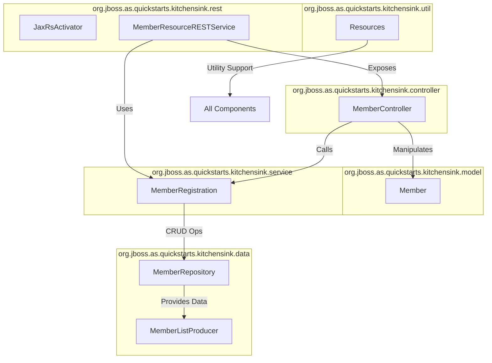

---

# Narrative Description

**Core Components and Their Package Groupings**

1. **Util (org.jboss.as.quickstarts.kitchensink.util)**
   - *Resources*: This class provides shared utility functions and resources that support other components across the system. It serves as a foundational helper that can be referenced by controllers, services, or data layers as needed.

2. **Controller (org.jboss.as.quickstarts.kitchensink.controller)**
   - *MemberController*: Acts as an intermediary between the UI or REST layer and the business logic. It processes user input, manages user interactions, and coordinates calls to the service layer.

3. **Model (org.jboss.as.quickstarts.kitchensink.model)**
   - *Member*: A domain entity representing a member within the system. It models the business data and rules tied to Members.

4. **Service (org.jboss.as.quickstarts.kitchensink.service)**
   - *MemberRegistration*: Encapsulates the core business logic related to member operations such as registration, updates, and validations. This layer orchestrates the workflow and delegates persistence tasks to the data layer.

5. **Data (org.jboss.as.quickstarts.kitchensink.data)**
   - *MemberRepository*: Responsible for persistence operations and data access to the underlying database or storage mechanism. It handles CRUD operations for Member entities.
   - *MemberListProducer*: Likely provides member-related data collections or producer methods for dependency injection. It serves as a data provider for other components.

6. **REST (org.jboss.as.quickstarts.kitchensink.rest)**
   - *JaxRsActivator*: Activates JAX-RS REST application and configures REST endpoints.
   - *MemberResourceRESTService*: Implements RESTful APIs exposing member-related services to external clients. It typically calls into the Service layer for business operations.

**Interactions**

- Clients interact with the system primarily through the **REST** endpoints provided by *MemberResourceRESTService*.
- The REST service calls into the **Service** layer (*MemberRegistration*) to perform business logic.
- *MemberRegistration* uses the **Data** layer (*MemberRepository*) to handle data persistence.
- The data layer may utilize *MemberListProducer* to produce lists or streams of member data.
- The **Controller** (*MemberController*) may be used to manage flow between the UI (if any) and the service layer; it also manipulates the **Model** (*Member*).
- The **Util** package provides shared resources or helper functionality used across the system.
- The *JaxRsActivator* configures the REST infrastructure.

This layered modular design reflects common Java EE architecture promoting separation of concerns: the REST layer exposes services, the service layer contains business logic, the data layer manages persistence, and the model provides domain objects. Utility classes support cross-cutting concerns.

---