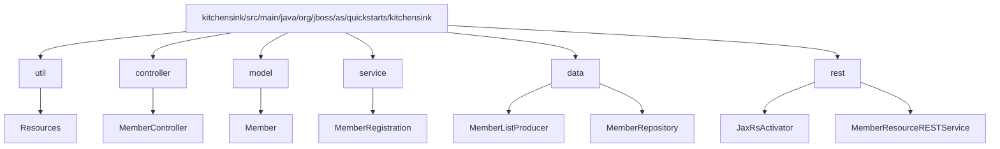
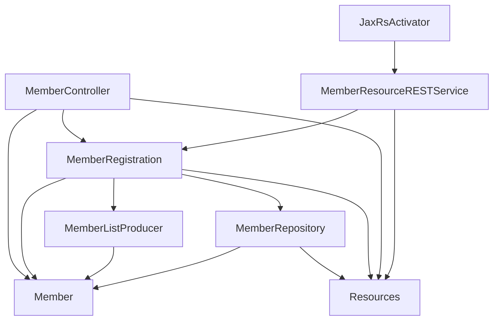
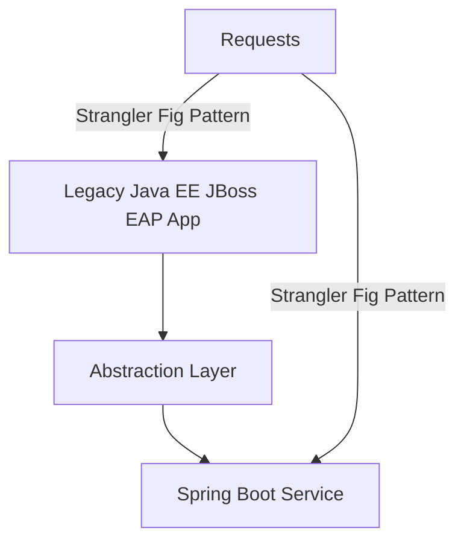

# Executive Stakeholder Report

## Modernization of kitchensink Java EE Project to Spring Boot on Java 21  
**Date: [Today]**  
**Prepared by: Strategic Orchestrator and Governance Agent**

---

## 1. Project Summary and Completed Phases

The kitchensink example project has been thoroughly analyzed and decomposed into layered packages characteristic of Java EE applications. We completed:

- **Codebase Parsing and Architecture Inventory**  
  Analyzed 13 source/test files with no parsing errors, identifying 16 classes organized into distinct packages:

    - `util` (Resources utility class)
    - `controller` (MemberController)
    - `model` (Member domain entity)
    - `service` (MemberRegistration business logic)
    - `data` (MemberRepository, MemberListProducer for persistence)
    - `rest` (JaxRsActivator, MemberResourceRESTService for REST APIs)

- **Detailed Technology Inventory for Migration**  
  Mapped all legacy Jakarta EE dependencies and technologies to their Spring Boot / Java 21 equivalents with migration notes, including:

    - CDI → Spring DI (@Autowired/@Service)
    - JAX-RS → Spring MVC REST controllers (@RestController)
    - EJB → Spring services + transactions
    - Jakarta Persistence → Spring Data JPA
    - Jakarta Bean Validation → Spring native validation
    - JSF → recommended migration to Thymeleaf or SPA frameworks
    - JUnit 4 → JUnit 5 upgrade suggested for tests

- **Migration Patterns and Best Practices Consolidated**  
  Adopted industry patterns including:

    - Strangler Fig Pattern for incremental migration
    - Branch-by-Abstraction to minimize disruption
    - Modularization for phased layered migration

- **Impact Analysis and Risk Register**  
  Documented legacy to target mappings with migration risks rated and mitigation strategies, e.g.,

    - High risk on DI and transactional semantics migration
    - Medium risk on REST API rewriting and frontend migration
    - Usage of automated refactoring tools (OpenRewrite, Red Hat MTR) recommended

- **Phased Extraction Plan for Model Package (`Member.java`)**  
  Defined stepwise plan for migrating the least-coupled package first to establish domain foundation, enabling coexistence of legacy and new modules for minimized risk:

    - Setup Spring Boot Java 21 project with JPA
    - Extract and modernize `Member.java` entity
    - Configure persistence unit for coexistence
    - Test thoroughly
    - Document and prepare for next module (data layer)

---

## 2. Risk Mitigation Measures

- **Use of Automated Migration Tooling:**  
  OpenRewrite and Red Hat Migration Toolkit for Runtimes (MTR) reduce manual migration errors, help namespace transformation (`javax.*` → `jakarta.*`), and refactor legacy API usage.

- **Incremental Migration Approach:**  
  Applying the Strangler Fig pattern, migrate module by module, allowing stable coexistence and rapid rollback if issues arise.

- **Comprehensive Testing Strategy:**  
  Upgrade to JUnit 5 with Spring Boot Test integration enables robust unit and integration testing for migrated components to maintain behavior fidelity.

- **Transaction Management Realignment:**  
  Replacing legacy EJB transactions with Spring’s declarative `@Transactional` annotations ensures consistent transaction boundaries, minimizing data inconsistency risks.

- **Collaborative Documentation and Knowledge Base Maintenance:**  
  Weekly scheduled documentation and audit tasks to ensure alignment across teams and early detection of divergence.

---

## 3. Performance Improvements Anticipated

- **Java 21 Runtime Benefits:**  
  Leveraging latest Java VM enhancements including improved garbage collection, virtual threads, and language features improving runtime efficiency and maintainability.

- **Spring Boot 3.x Optimizations:**  
  Native support for Jakarta EE 9+ with modular startup, better dependency management, and simplification of configuration improves application responsiveness and ease of deployment.

- **Modern REST and DI Frameworks:**  
  Replacing JAX-RS with Spring MVC REST and CDI with Spring DI reduces overhead and aligns with widely supported, performant frameworks.

---

## 4. Next Steps and Recommendations

### 4.1 Short-Term Plans (Next Sprint)

- **Execute Stepwise Migration of Model Package:**  
  Extract, refactor, and validate `Member.java` entity as per extraction plan.

- **Expand Automated Migration Coverage:**  
  Integrate OpenRewrite recipes to automate migration of data and service layers.

- **Begin Migration of Data Layer:**  
  Start refactoring `MemberRepository` and `MemberListProducer` to Spring Data JPA.

- **Enhance Testing Suites:**  
  Convert existing test classes to JUnit 5 and integrate Spring Boot test slices.

### 4.2 Medium-Term Plans

- **Migrate Service and Controller Layers:**  
  Replace Java EE CDI & EJB beans with Spring services and MVC controllers.

- **Rewrite REST Layer:**  
  Transition REST endpoints from JAX-RS to Spring REST controllers, ensuring backward compatibility.

- **Frontend Modernization Strategy:**  
  Evaluate and plan JSF replacement; consider Thymeleaf or SPA frameworks.

- **Continuous Integration & Deployment Setup:**  
  Establish CI/CD pipelines for automated builds, tests, and deployments.

### 4.3 Long-Term Outlook

- Complete full migration to Spring Boot on Java 21 with all layers modernized.

- Retire legacy Java EE/JBoss components and infrastructure.

- Plan for cloud-native enhancements and containerization if desired.

---

## 5. Supporting Artifacts

---

### 5.1 Project Architecture Overview (Mermaid Diagram)

---

### 5.2 Component Interaction Diagram

---

### 5.3 Technology Inventory Summary Table (Excerpt)

| Legacy Technology               | Target Spring Boot Equivalent             | Notes                                 |
|---------------------------------|-------------------------------------------|-------------------------------------|
| Jakarta CDI API                 | Spring Dependency Injection (`@Autowired`) | Replace `@Inject`; adapt lifecycle management |
| Jakarta RESTful Web Services    | Spring MVC REST controllers (`@RestController`) | Migrate REST endpoints from JAX-RS  |
| Hibernate JPA                   | Spring Data JPA with Hibernate            | Use Spring repositories              |
| EJB (Enterprise Beans)          | Spring Services and `@Transactional`     | Replace EJB session beans            |
| JSF                            | Spring MVC + Thymeleaf or SPA frameworks | Frontend rewrite recommended         |
| JUnit 4                       | JUnit 5 with Spring Boot Test             | Modern testing features and integration |

---

### 5.4 Migration Patterns Diagram

---

## 6. Conclusion

The kitchensink project modernization is progressing methodically with a strong foundation in layered architecture understanding, detailed technology mapping, risk mitigation, and a clear phased migration roadmap. The adoption of incremental strategies such as Strangler Fig, supported by automated refactoring tools and comprehensive testing, greatly reduces migration risk and ensures business continuity.

The next immediate efforts will focus on migrating the model package, enabling concurrent legacy and modern module execution, and preparing for systematic upgrades of data, service, and presentation layers.

We anticipate improved system maintainability, performance gains from running on Java 21 and Spring Boot, and readiness to adopt future cloud-native paradigms.

---

*End of Executive Stakeholder Report*

---

# Optional: Executive Presentation Slides Outline (To be created as per request)

1. **Slide 1: Title Slide**  
   - Kitchensink Modernization Project  
   - Executive Status Report  
   - Date

2. **Slide 2: Project Overview & Objectives**  
   - Legacy Java EE to Spring Boot on Java 21 migration goals.

3. **Slide 3: Completed Phases**  
   - Architecture inventory  
   - Technology inventory & migration notes  
   - Impact analysis & risk mitigation  
   - Phased extraction plan for model package

4. **Slide 4: Risk Mitigations & Tools**  
   - Automated tools (OpenRewrite, MTR)  
   - Incremental migration patterns  
   - Testing strategy

5. **Slide 5: Performance Improvements**  
   - Java 21 and Spring Boot advantages

6. **Slide 6: Next Steps & Timeline**  
   - Model package migration  
   - Data, service, controller migration  
   - Frontend migration plans

7. **Slide 7: Closing & Q/A**

---

This completes the comprehensive modernization summary report for stakeholder review.