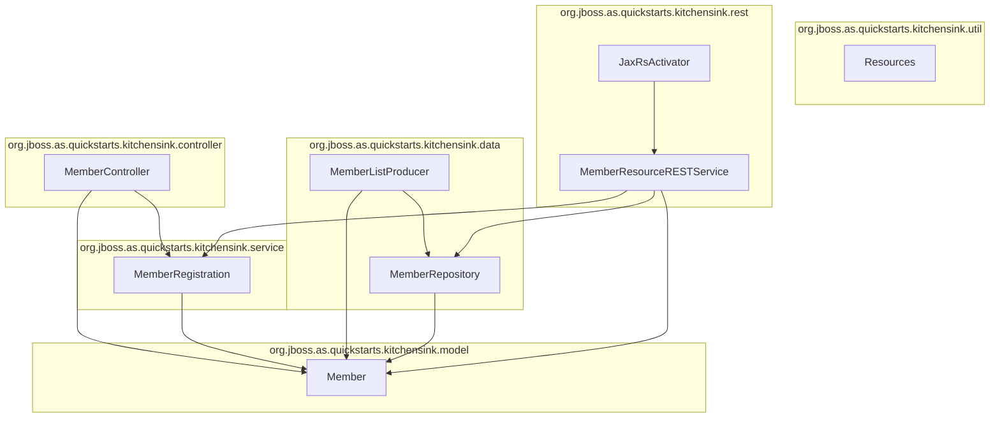

Narrative:

The Kitchensink project is modularized into six main packages:

1. org.jboss.as.quickstarts.kitchensink.util:
   - Contains utility class `Resources`, which provides general helper functions such as producing loggers for injection points.
   - Independent utility without outward module dependencies.

2. org.jboss.as.quickstarts.kitchensink.model:
   - Contains domain model class `Member`.
   - Represents the core data entity for a member with typical getters/setters for properties such as id, name, email, and phone number.

3. org.jboss.as.quickstarts.kitchensink.data:
   - Includes data access classes `MemberRepository` for CRUD operations on `Member` entities and `MemberListProducer` which produces event notifications when the member list changes.
   - Depends on `model` for the `Member` class.

4. org.jboss.as.quickstarts.kitchensink.service:
   - Contains business logic class `MemberRegistration` responsible for registering new members.
   - Operates on the `Member` model objects.

5. org.jboss.as.quickstarts.kitchensink.controller:
   - Manages UI interaction logic via `MemberController`.
   - Depends on `service` for member registration functionality and `model` for member representation.
   - Provides methods to initialize new members, register them, and handle error messages.

6. org.jboss.as.quickstarts.kitchensink.rest:
   - Exposes RESTful web services through `MemberResourceRESTService` and activates JAX-RS application via `JaxRsActivator`.
   - Interacts with `data` for member retrieval and persistence, `service` for registration business logic, and `model` for domain entities.
   - REST service supports listing all members, lookup by ID, creation, validation, and duplicate email checking.

Component Interactions:

- The REST layer (`rest` package) acts as the external interface, handling HTTP requests and invoking service and data operations.
- The controller layer handles UI-driven interactions with the user interface, working closely with service and model layers.
- The service layer contains core business logic, including member registration, and depends on model entities.
- The data layer abstracts persistence and event production for member entities.
- Utilities provide general support functions like logging.
- Domain model classes are the foundation for data and service processing.

Together, these layers form the architecture of the Kitchensink application following clean separation of concerns, modular packaging, and clear interaction paths facilitating maintainability and extensibility.