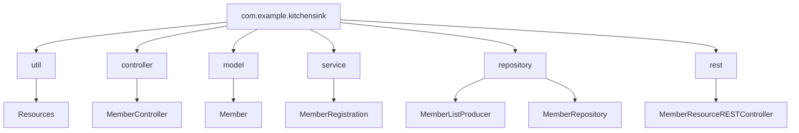
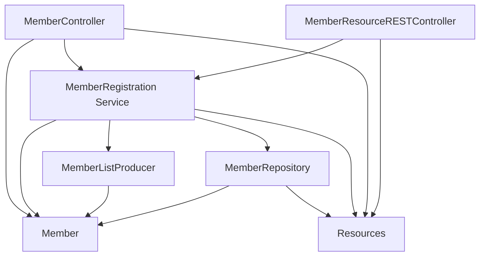

# Impact Analysis Document: kitchensink Project Migration from Legacy JBoss Java EE to Java 21 + Spring Boot

---

## 1. Legacy → Java 21 and Spring Boot Namespace and Package Mapping

| Legacy Package                               | Legacy Classes / Roles                              | Java 21 + Spring Boot Package/Module Equivalent                                    | Notes                                                                                  |
|---------------------------------------------|---------------------------------------------------|-------------------------------------------------------------------------------------|----------------------------------------------------------------------------------------|
| `org.jboss.as.quickstarts.kitchensink.util` | `Resources` utility class                          | `com.example.kitchensink.util` (Spring Boot utilities package)                      | Utilities migrated as-is; use Spring Boot resource loading mechanisms                   |
| `org.jboss.as.quickstarts.kitchensink.controller` | `MemberController` handles MVC web requests       | `com.example.kitchensink.controller` annotated with `@Controller` or `@RestController` | Convert from Java EE MVC managed beans to Spring MVC controllers                        |
| `org.jboss.as.quickstarts.kitchensink.model` | `Member` domain entity                             | `com.example.kitchensink.model` with updated JPA annotations                        | Use Jakarta Persistence API (`jakarta.persistence`), adopt Java 21 enhancements        |
| `org.jboss.as.quickstarts.kitchensink.service` | `MemberRegistration` business logic               | `com.example.kitchensink.service` annotated with `@Service`                         | Replace EJB or CDI beans with Spring Services; use Spring's `@Transactional` as needed |
| `org.jboss.as.quickstarts.kitchensink.data` | `MemberRepository`, `MemberListProducer` data access | `com.example.kitchensink.repository` using Spring Data JPA repositories             | Migrate JPA EntityManager usage to Spring Data JPA repositories                        |
| `org.jboss.as.quickstarts.kitchensink.rest` | `JaxRsActivator`, `MemberResourceRESTService`     | `com.example.kitchensink.rest` with `@RestController` endpoints                      | Migrate from JAX-RS to Spring MVC REST controllers                                     |
| `org.jboss.as.quickstarts.kitchensink.test` | `RemoteMemberRegistrationIT`, `MemberRegistrationIT` test classes | `com.example.kitchensink.test` using JUnit 5 + Spring Boot Test                      | Upgrade from JUnit 4 to JUnit Jupiter for Spring Boot test integration                  |

---

## 2. Key Legacy Constructs Removed or Changed and Migration Risks

| Legacy Construct                            | Replacement in Java 21 + Spring Boot                 | Migration Risk & Impact                                                              | Notes / Mitigation                                                                     |
|--------------------------------------------|------------------------------------------------------|-------------------------------------------------------------------------------------|----------------------------------------------------------------------------------------|
| `javax.enterprise.inject` (CDI)            | Spring Framework Dependency Injection (`@Autowired`, `@Service`) | Medium: Dependency injection semantics differ; requires code refactor and testing   | Use constructor injection; migrate producers/qualifiers carefully                     |
| `javax.ejb` Session Beans                    | Spring Beans with `@Service` and `@Transactional`   | Medium-High: Transactions and lifecycle differ; careful transactional boundaries     | Adopt Spring transactions with `@Transactional`; test transaction demarcations       |
| JAX-RS REST Annotations (`@Path`, `@GET`)   | Spring MVC REST Annotations (`@RestController`, `@GetMapping`) | Medium: Path and param mappings differ; require reimplementation of endpoints        | Use Spring MVC REST patterns, migrate exception handling accordingly                  |
| JSF (`javax.faces`) Frontend                  | Spring MVC + Thymeleaf or SPA frameworks (React/Angular) | High: Frontend technology change entails significant UI rewrite                     | Plan gradual UI replacement; use Strangler Fig pattern                                |
| Package namespaces from `javax.*` to `jakarta.*` | Change to consistent `jakarta.*` namespaces          | Low: Compiler and imports need updates; automated tooling (OpenRewrite) helps        | Apply automated refactoring tools                                                   |
| Hibernate Validator and Bean Validation       | Spring Boot-native validation with Hibernate Validator | Low: Mostly compatible; config adjustments may be needed                            | Validate bean validation constraints during migration                                |
| JPA Entities and Repositories                  | Use Spring Data JPA repositories                      | Low-Medium: Repository interfaces and EntityManager usage may change                 | Rewrite data layer repositories; use Spring Data JPA conventions                       |
| Activation and other Jakarta EE modules        | Managed transitively by Spring Boot starters          | Low: Usually no direct action needed                                                 | Verify dependencies in gradle/maven                                                 |
| Legacy logging (`org.jboss.logging`)            | SLF4J + Logback as Spring Boot logging backend         | Low: Configure Logback with appropriate logging configuration                       | Migrate logging configs; replace logger usage                                        |
| Unit Testing (JUnit 4)                            | JUnit 5 + Spring Boot Test                             | Low: Rewrite tests for JUnit 5; adapt test lifecycle and annotations                | Incremental migration; adopt `@SpringBootTest` annotations                           |

---

## 3. Risk Register with Severity Levels

| Risk ID | Risk Description                                  | Severity | Probability | Mitigation Strategy                                                             |
|---------|-------------------------------------------------|----------|-------------|---------------------------------------------------------------------------------|
| R1      | Dependency injection conflicts and behavioral differences | High     | Medium      | Refactor all DI to Spring style; implement comprehensive unit and integration tests |
| R2      | Transaction management mismatch and data consistency risks | High     | Medium      | Use Spring `@Transactional`; thorough testing of transactional boundaries       |
| R3      | REST API rewriting leading to endpoint regressions | Medium   | High        | Implement full integration tests for REST endpoints; migrate gradually          |
| R4      | Frontend rewrite from JSF to Thymeleaf or SPA     | High     | High        | Plan phased frontend migration; use feature toggles; parallel UI development     |
| R5      | Namespace migration errors from `javax` to `jakarta` | Medium   | Medium      | Use automated tools (OpenRewrite); manual code review                           |
| R6      | Library version incompatibility or API changes    | Medium   | Medium      | Upgrade dependencies carefully; test all layers                              |
| R7      | Data access layer migration to Spring Data JPA     | Medium   | Medium      | Refactor repository classes carefully; verify SQL queries and performance       |

---

## 4. Recommended Migration Patterns per Component

| Package/Layer           | Recommended Migration Pattern                     | Description and Best Practices                                                        |
|------------------------|--------------------------------------------------|--------------------------------------------------------------------------------------|
| util                    | Lift and Shift with Cleanup                       | Move utility classes as-is; refactor to use Spring Boot resource APIs as needed      |
| controller (MVC)        | Branch-by-Abstraction + Spring MVC Rewrite       | Introduce controller interfaces; implement Spring MVC controllers behind abstraction |
| model (Entities)        | Strangler Fig + Incremental Refactoring          | Update data model annotations; migrate entities with backward compatibility          |
| service (Business Logic)| Spring Bean Conversion with Transactional Support| Replace Java EE beans with Spring `@Service`; add `@Transactional` where required    |
| data (Repositories)     | Spring Data JPA Adoption                           | Convert to Spring Data interfaces; leverage repository abstractions                  |
| rest (APIs)             | Incremental Rewrite to Spring Web MVC REST        | Convert JAX-RS services to `@RestController`; map paths carefully                    |
| tests                   | Upgrade to JUnit 5 and Spring Boot Testing       | Rework tests to use latest frameworks; implement continuous integration testing       |

---

## 5. Mermaid Package Hierarchy Diagram (Post-Migration)

---

## 6. Mermaid Component Interaction Diagram (Post-Migration)

---

## 7. Summary

The kitchensink legacy application consists of layered architecture typical of Java EE on Red Hat JBoss, involving distinct packages for utilities, controllers, domain models, services, data repositories, and REST endpoints. Migrating to Java 21 and Spring Boot entails:

- Refactoring namespaces from legacy `org.jboss.as.quickstarts.kitchensink.*` to a clean Spring Boot style package (e.g., `com.example.kitchensink.*`) with layered organization.

- Replacing Jakarta EE standards such as CDI, EJB, JPA, and JAX-RS with Spring Dependency Injection, Services, Spring Data JPA, and Spring MVC REST.

- Migration risks focus heavily on transactional boundaries, dependency injection differences, REST endpoint rewriting, and frontend technology changes.

- Recommended migration patterns include incremental rewriting (Strangler Fig), abstraction layers (Branch-by-Abstraction), and modularization.

- Use automated tools to convert packages from `javax.*` to `jakarta.*` namespaces and refactor legacy APIs to modern Spring idioms.

- Test rigorously during migration to ensure behavioral fidelity.

This document provides a comprehensive map and risk assessment for the migration, serving as a blueprint for phased modernization with prioritized business value modules (services, data, REST APIs) and allows scheduling documentation and audit tasks in alignment with an Agile sprint cadence.

---

This completes the detailed Impact Analysis document with legacy to Java 21 and Spring Boot mapping, migration risks, and recommended migration patterns for the kitchensink modernization effort.