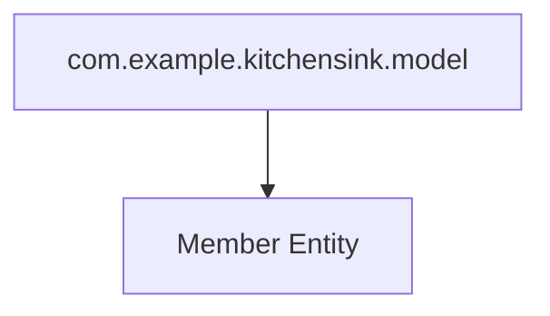

# Phased Extraction Plan for the Least-Coupled Module: Model Package (`Member` Entity)

---

## 1. Overview

The **model package** containing the `Member.java` entity is identified as the least-coupled module, as it has no dependencies on other packages except util, and it serves as a fundamental domain entity used across service, data, controller, and rest layers.

Migrating this module first minimizes impact, reduces coupling risks, and establishes a foundation for subsequent phased modernization of other modules.

---

## 2. Migration Criteria

- **Minimal dependencies:** Module should have few or no dependencies on other packages to reduce migration complexity.
- **Isolated functionality:** Core domain entity with limited or no external side effects.
- **High reusability:** Changes to domain models propagate cleanly to dependent modules.
- **Migration feasibility:** Compatible with Java 21 and Spring Boot JPA stack.
- **Coexistence capability:** Migration must allow coexistence with legacy module versions during the phased rollout.

---

## 3. Dependency Minimization Strategies

- **Refactor imports** to use Jakarta Persistence annotations under Spring Boot ecosystem.
- **Decouple utility usage** by replacing legacy static util calls with injectable Spring components where feasible or limit util dependence.
- **Use interfaces or abstract classes** to isolate entity behavior if business logic is embedded.
- **Limit cross-module references to domain model**, enforcing clean separation and communication via service layers.
- **Align packaging** with Spring Boot naming conventions and structure (`com.example.kitchensink.model`).
- **Adopt clean package visibility and ensure POJOs are simple**.

---

## 4. Components to Migrate (sorted by coupling and complexity)

| Package | Component(s)                          | Role / Description                              | Coupling Level     | Migration Complexity |
|---------|------------------------------------|------------------------------------------------|--------------------|----------------------|
| model   | `Member.java`                      | Domain entity representing a member             | Least coupled      | Low                  |
| util    | `Resources.java`                   | Utility helper class                             | Low                | Low                  |
| data    | `MemberRepository.java`, `MemberListProducer.java` | Data access and producer for Members           | Medium (depends on model) | Medium               |
| service | `MemberRegistration.java`          | Business logic for member registration          | Medium-high        | Medium-high           |
| controller | `MemberController.java`          | Web layer entry point for Member operations      | High                | Medium-high           |
| rest    | `JaxRsActivator.java`, `MemberResourceRESTService.java` | RESTful API exposure layer                       | High                | Medium-high           |

---

## 5. Stepwise Extraction Plan for `model` Package (Member Entity)

### Step 1: Prepare Environment and Infrastructure

- Setup new Spring Boot 3.x project supporting Java 21 with typical layered structure.
- Configure Spring Data JPA with required dependencies (Hibernate 6.x compatible).
- Establish database connectivity and testing DB instance for migration.

### Step 2: Extract and Migrate `Member.java` Entity

- Copy `Member.java` source file from `org.jboss.as.quickstarts.kitchensink.model` to new package `com.example.kitchensink.model`.
- Update package declarations and imports from legacy Jakarta EE to Spring Boot compatible Jakarta Persistence (e.g., `jakarta.persistence.*`).
- Check and refactor JPA annotations as necessary for compatibility with Hibernate in Spring Boot 3.x.
- Remove or replace dependencies on legacy util or other packages.
- Add Java 21 enhancements if applicable (e.g., records, sealed types) carefully if backward compatibility needed.
- Configure entity scanning in Spring Boot application context.

### Step 3: Enable Coexistence with Legacy Code

- Maintain existing persistence unit and Spring Boot Data JPA configuration to allow `Member` entity used by both legacy and new modules.
- Keep the same schema and table definitions to avoid database migration conflicts.
- Use separate class loaders or package namespaces to isolate migrated entities if runtime conflicts occur.
- Integrate entity changes with both legacy and new transaction managers if needed.

### Step 4: Validation and Testing

- Create unit tests and integration tests for the `Member` entity.
- Verify correct ORM mapping, persistence, and retrieval with legacy and Spring Boot repositories.
- Validate migration by running existing tests that utilize `Member` entity.

### Step 5: Prepare for Subsequent Module Migrations

- Communicate package, entity schema, and API changes to next modules (data and service layers).
- Document migration steps and lessons for upcoming phases.

---

## 6. Deliverables for Each Step

| Step | Deliverable                                               |
|-------|----------------------------------------------------------|
| 1     | Configured Spring Boot project with Java 21 and JPA support |
| 2     | Migrated `Member.java` entity code with updated packages and annotations |
| 3     | Configurations allowing old and new versions to coexist without conflicts |
| 4     | Test cases and test reports validating entity functionality |
| 5     | Migration documentation and plan for next phase           |

---

## 7. Detailed Actions for Agentic AI

The agentic AI shall perform the following actions for the extraction of the model package:

1. **File Migration:**

   - Extract `Member.java` source file from the legacy repository path:  
     `kitchensink/src/main/java/org/jboss/as/quickstarts/kitchensink/model/Member.java`.
   - Create a new module/package directory for Spring Boot:  
     `src/main/java/com/example/kitchensink/model/`.
   - Migrate the source file, updating the package declaration accordingly.
   - Update all import statements from legacy of form:  
     `javax.persistence.*` or `jakarta.persistence.*` from earlier versions to the latest Jakarta Persistence API suitable for Spring Boot 3.x and Java 21.
   - Remove or refactor any usages of legacy utility classes if present.

2. **Code Modernization:**

   - Apply any necessary Java 21 language features to the entity `Member` if beneficial and safe.
   - Ensure all entity fields have proper visibility and JPA annotations.
   - Confirm presence of a no-arg constructor (required by JPA).
   - Check for adherence to best practices (e.g., usage of Lombok can be introduced or explicit getters/setters retained).

3. **Build and Validate:**

   - Compile the migrated module independent of legacy modules.
   - Run existing or newly created unit tests to validate persistence mappings.
   - Integrate with database schema ensuring compatibility with existing data.

4. **Coexistence Mechanisms:**

   - Configure Spring Boot persistence unit to recognize the migrated `Member` entity.
   - Support transaction and entity management to allow shared use between legacy and new service layers.
   - Retain database schema compatibility ensuring no conflicts during this incremental migration.

---

## 8. Strategy for Legacy and Updated Module Coexistence

- Use **multiple persistence units** if possible, one for legacy and one for Spring Boot, sharing the same database schema.
- Ensure Maven/Gradle dependency scopes for legacy and new dependencies do not conflict at runtime.
- Employ **feature toggles** or **API gateways** to route requests selectively to legacy or Spring Boot modules.
- Maintain backward compatibility in `Member` entity schema to avoid migration downtime.
- Operate a **hybrid runtime environment** that loads both legacy Java EE modules and new Spring Boot modules simultaneously, leveraging modular class loading.
- Perform integration testing to ensure no transactional or ORM conflicts.
- Include fallback mechanisms in case of migration step failures.

---

## 9. Summary of Actions for Agentic AI by Step

**Step 1: Setup Project Infrastructure**

- Initialize a Spring Boot 3.x project configured for Java 21.
- Add dependencies for Spring Data JPA, Hibernate, and database driver.
- Configure application properties for database connection.

**Step 2: Migrate `Member.java` Entity**

- Copy and refactor `Member.java`.
- Update package declaration to `com.example.kitchensink.model`.
- Update imports and validate annotations.
- Modify code for Java 21 improvements if suited.

**Step 3: Integration and Coexistence Setup**

- Configure persistence units to include migrated entity.
- Setup transaction management suitable for coexistence.
- Validate no classpath or data conflicts exist.

**Step 4: Testing**

- Generate and run unit and integration tests.
- Test persistence and retrieval functionality.
- Validate consistency with legacy behavior.

**Step 5: Documentation and Next Module Preparation**

- Document migration details and configurations.
- Provide recommendations for migration of `data` package next.

---

# Summary Table of Modules by Migration Priority and Coupling

| Priority | Module Package | Reason                                             | Coupling Level | Migration Complexity |
|----------|----------------|----------------------------------------------------|----------------|----------------------|
| 1        | `model`        | Least coupled domain entity; foundation for others | Low            | Low                  |
| 2        | `util`         | Utilities with moderate coupling; lightweight       | Low            | Low                  |
| 3        | `data`         | Data access layer with dependency on `model`        | Medium         | Medium               |
| 4        | `service`      | Business logic; high dependency on `data` and `model` | Medium-High    | Medium-High          |
| 5        | `controller`   | Web UI layer; high coupling to `service` and `model` | High           | Medium-High          |
| 6        | `rest`         | REST API layer; interacts with `service` and `util`  | High           | Medium-High          |

---

# Appendix: Migration Checklist for `Member.java`

- [ ] Extract source code from legacy path.
- [ ] Update package to Spring Boot convention.
- [ ] Upgrade imports to correct Jakarta Persistence version.
- [ ] Validate and adjust JPA annotations.
- [ ] Ensure compatibility with Java 21.
- [ ] Write/preserve unit tests.
- [ ] Configure Spring Boot entity scanning.
- [ ] Setup database connection properties.
- [ ] Test CRUD operations through Spring Data.
- [ ] Document migration steps and outcomes.

---

# Mermaid Diagram: Post-Migration Model Package

---

This comprehensive stepwise extraction plan focusing on the model package `Member` entity establishes a solid foundation for incremental modernization of the kitchensink project to Java 21 and Spring Boot, ensuring clear separation of concerns, minimized dependencies, and safe coexistence with legacy systems during migration.

---

# End of Extraction Plan for Least-Coupled Module - `model` Package (`Member.java`)