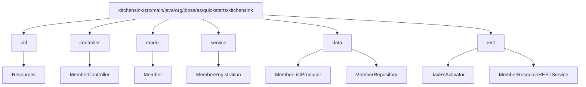
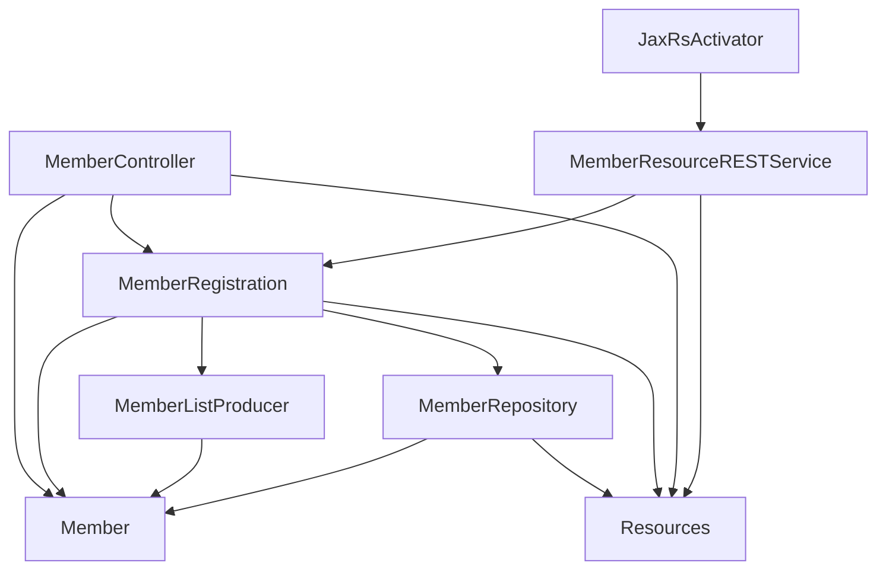

# Technology Inventory for kitchensink Java EE Project Migration to Spring Boot on Java 21

---

## 1. Jakarta Enterprise CDI API  
- **Current Version:** 4.0.1.redhat-00001 (Jakarta CDI API)  
- **Usage Context:** Provides dependency injection and contextual lifecycle management in the application (beans, interceptors, producers). Used heavily in service, data, and controller layers.  
- **Migration Notes:**  
   - Use Spring Framework's native Dependency Injection and Context support.  
   - Replace `@Inject` with `@Autowired` or constructor injection in Spring.  
   - Spring Boot 3.x with Spring Framework 6.x supports Java 21 and provides full DI capabilities.  
- **References:**  
   - [Spring Boot 3.x & Java 21 Migration Handbook](https://blog.stackademic.com/spring-boot-3-x-java-21-simplistic-migration-handbook-d93053978d27)  
   - [Jakarta EE vs Spring Boot Dependency Injection](https://blog.payara.fish/jakarta-ee-vs.-spring-boot-choosing-the-right-framework-for-your-project)  

---

## 2. JUnit (Version 4.13.1)  
- **Usage Context:** Unit testing framework used in test scope.  
- **Migration Notes:**  
   - Consider upgrading to JUnit 5 (JUnit Jupiter) for modern features and better integration with Spring Boot testing.  
   - Spring Boot Test starter supports JUnit 5 natively.  
- **References:**  
   - [Spring Boot Testing Documentation](https://spring.io/guides/gs/testing-web/)  

---

## 3. Hibernate JPA ModelGen (6.2.13.Final)  
- **Usage Context:** Annotation processor for generating JPA static metamodel classes.  
- **Migration Notes:**  
   - Compatible with Spring Data JPA and Hibernate ORM used in Spring Boot projects.  
   - Check compatibility of Hibernate versions when upgrading dependencies to align with Spring Boot 3.x dependencies.  
- **References:**  
   - [Spring Data JPA and Hibernate](https://spring.io/projects/spring-data-jpa)  

---

## 4. Jakarta Activation API (2.1.2)  
- **Usage Context:** API for MIME type data handling, typically for email or XML processing.  
- **Migration Notes:**  
   - Spring Boot manages these dependencies transitively. Typically no manual action unless direct usage requiring update.  
- **References:**  
   - Spring Boot dependency management documentation.  

---

## 5. Hibernate Validator (8.0.0.Final) & Jakarta Bean Validation API (3.0.2)  
- **Usage Context:** Bean validation framework for ensuring constraints on domain models.  
- **Migration Notes:**  
   - Spring Boot supports Hibernate Validator out-of-the-box for validation annotations.  
   - Usage of `@Valid` and validation groups are supported similarly.  
- **References:**  
   - [Spring Validation Guide](https://docs.spring.io/spring-framework/docs/current/reference/html/core.html#validation)  

---

## 6. Jakarta Persistence API (3.1.0)  
- **Usage Context:** Object-relational mapping API for entity management.  
- **Migration Notes:**  
   - Spring Boot uses Jakarta Persistence via Spring Data JPA.  
   - Adjust imports from `javax.persistence.*` to `jakarta.persistence.*` as already in usage.  
- **References:**  
   - [Spring Data JPA Migration Guide](https://spring.io/guides/gs/accessing-data-jpa/)  

---

## 7. Jakarta RESTful Web Services API (3.1.0)  
- **Usage Context:** REST endpoints exposed using JAX-RS (Jakarta REST).  
- **Migration Notes:**  
   - Spring Boot prefers using Spring MVC / WebFlux REST annotations (@RestController, @RequestMapping).  
   - Migrate endpoints to Spring MVC controllers.  
   - Use Spring Boot starters: `spring-boot-starter-web`.  
- **References:**  
   - [Migrating from JAX-RS to Spring MVC](https://dzone.com/articles/jax-rs-vs-spring-mvc)  

---

## 8. Jakarta Faces API (4.0.1)  
- **Usage Context:** JSF for MVC front-end web views.  
- **Migration Notes:**  
   - Spring Boot typically uses Thymeleaf or Spring MVC views in place of JSF.  
   - Consider rewriting UI layer to use Spring MVC + Thymeleaf or other supported view technologies.  
- **References:**  
   - [Spring MVC View Technologies](https://spring.io/guides/gs/serving-web-content/)  

---

## 9. Jakarta Enterprise Beans API (4.0.1)  
- **Usage Context:** EJB services potentially for transactional business logic.  
- **Migration Notes:**  
   - Replace EJB with Spring's declarative transactions and Spring Beans.  
   - Use `@Transactional` in Spring.  
- **References:**  
   - [Spring Transaction Management Guide](https://docs.spring.io/spring-framework/docs/current/reference/html/data-access.html#transaction)  

---

## 10. Jakarta Annotation API (2.1.1)  
- **Usage Context:** Standard Java annotations usage.  
- **Migration Notes:**  
   - Included and managed transitively by Spring Boot starter dependencies. No manual migration needed.  

---

## 11. Jakarta XML Bind API (4.0.0)  
- **Usage Context:** JAXB for XML binding.  
- **Migration Notes:**  
   - Use latest JAXB implementations compatible with Java 21. Usually managed by Spring Boot starters.  
- **References:**  
   - [Spring Boot JAXB Support](https://docs.spring.io/spring-boot/docs/current/reference/htmlsingle/#using-boot-starter-xml)  

---

## 12. Jakarta JSON Processing API (2.1.2) & Parsson (1.1.2)  
- **Usage Context:** JSON Parsing and Processing.  
- **Migration Notes:**  
   - Spring Boot typically uses Jackson for JSON serialization/deserialization.  
   - Remove direct usage or replace with Jackson and Spring MVC REST support out-of-the-box.  

---

# Summary and Best Practices for Migration

- Upgrade to Spring Boot 3.x (3.2+), which fully supports Java 21 and Jakarta EE 9+ (package namespace jakarta.*).  
- Replace Java EE dependency injection (CDI) with Spring DI annotations.  
- Migrate REST endpoints from JAX-RS to Spring Web MVC (@RestController).  
- Convert EJB components to Spring-managed beans with transactional annotations.  
- For UI, consider alternative to JSF, such as Spring MVC with Thymeleaf due to no native Spring Boot JSF support.  
- Use Spring Data JPA for persistence instead of direct JPA entity managers.  
- Replace Hibernate Validator usage as Spring Boot supports it natively.  
- Upgrade unit tests to JUnit 5 to leverage Spring Boot testing features.  
- Use tools like Eclipse Transformer or OpenRewrite for automating javax.* to jakarta.* namespace migration and other refactorings.  
- Refer to online migration guides for detailed steps and troubleshooting:  
   - [Spring Boot 3 Migration Guide](https://spring.io/blog/2022/11/24/spring-boot-3-0-goes-ga)  
   - [OpenRewrite Spring Boot Recipes](https://docs.openrewrite.org/recipes/java/spring/boot3/springboot3bestpractices)  
   - [Jakarta EE to Spring Boot Migration Discussions](https://dzone.com/articles/best-practices-to-deal-with-javax-to-jakarta-migra)  

---

# Mermaid Package Hierarchy Diagram

# Mermaid Component Interaction Diagram

---

This completes the detailed technology inventory and migration notes for the kitchensink project from Jakarta EE to Spring Boot on Java 21.