## Summary

The **DocumentationCrew** is an **agentic AI system** that autonomously:

1. **Analyzes** an existing codebase using static analysis and dependency discovery.
2. **Generates** a detailed transformation plan, mapping legacy constructs to modern equivalents.
3. **Executes** the plan by updating package dependencies, refactoring deprecated or inefficient code, switching to new frameworks, and incorporating security best practices.

This system leverages both **custom tools** and **CrewAI-built utilities** to ensure a robust, end-to-end modernization workflow.

---

## 1. Crew Definition

We define a **hierarchical** process managed by a central orchestrator. The crew comprises five specialized agents:

| Agent ID                     | Role                                              | Goal                                                                                                                                                     |
| ---------------------------- | ------------------------------------------------- | -------------------------------------------------------------------------------------------------------------------------------------------------------- |
| **project\_manager\_agent**  | Strategic Orchestrator and Governance Agent       | Coordinate all phases, prioritize modules by business value, maintain the knowledge base, schedule tasks, and audit outputs against quality gates.       |
| **codebase\_analyst\_agent** | Technical Investigator and Dependency Mapper      | Perform exhaustive static analysis and dependency mapping: index files, detect deprecated APIs, and build a detailed modernization incidents report.     |
| **documentation\_agent**     | Knowledge Synthesizer and Narrative Architect     | Transform code insights into human-readable artifacts: auto-generate Javadoc, high-level overviews, and Mermaid diagrams for architecture and flows.     |
| **domain\_expert\_agent**    | Compliance Validator and Business-Rule Consultant | Validate documentation against banking regulations and business workflows; deliver compliance reports and flag issues per Basel III and ISO 20022.       |
| **migration\_agent**         | Migration Strategist and Architecture Integrator  | Consolidate docs into a phased migration roadmap: map legacy to Java 21/Spring Boot, assess risks, and plan incremental extraction using best practices. |

---

## 2. Tools Catalog

This implementation declares the following tools:

| Tool Name                | Source                    | Description                                                                                                               |
| ------------------------ | ------------------------- | ------------------------------------------------------------------------------------------------------------------------- |
| **CodeParserTool**       | `tools/code_parser`       | Parses source files into an AST, extracts class/method signatures, and builds a file‐level index.                         |
| **DependencyMapperTool** | `tools/dependency_mapper` | Reads Maven/Gradle metadata and JAR analysis (via `jdeps`) to map external libraries, inter-module links, and versioning. |
| **JDepsTool**            | `tools/jdeps_tool`        | A wrapper around the `jdeps` CLI for deep dependency inspection of Java artifacts.                                        |
| **SerperDevTool**        | `crewai_tools`            | Internet search utility for retrieving migration best practices, case studies, and external references.                   |
| **DirectoryReadTool**    | `crewai_tools`            | Recursively reads directory structures to locate source directories and resources.                                        |
| **FileReadTool**         | `crewai_tools`            | Reads file contents (code, configs, docs) for downstream processing by other agents.                                      |

*Note: Additional tools (e.g., AST-based refactoring, DiffAnalyzer, RiskAssessment) can be integrated as needed.*

---

## 3. Task Breakdown

Tasks are defined in `tasks.yaml` and executed by the responsible agent in a **hierarchical** workflow:

| Task ID                                  | Description                                                                                                                                          | Responsible Agent        | Human Input Required |
| ---------------------------------------- | ---------------------------------------------------------------------------------------------------------------------------------------------------- | ------------------------ | -------------------- |
| **extract\_file\_metadata**              | Parse each Java file to extract package declarations, class/interface names, and module affiliations; build a file‐level index with error summaries. | codebase\_analyst\_agent | No                   |
| **generate\_system\_architecture**       | Produce high-level system architecture diagrams (Mermaid) and narrative describing module hierarchies and interactions.                              | documentation\_agent     | No                   |
| **generate\_module\_docs**               | For each key module: enhance Javadoc, write overviews, and generate Mermaid class/sequence diagrams.                                                 | documentation\_agent     | No                   |
| **component\_technology\_inventory**     | Enumerate all components, libraries, and frameworks; research migration pathways to Spring Boot on Java 21 and compile best-practice references.     | codebase\_analyst\_agent | No                   |
| **research\_migration\_best\_practices** | Summarize web-sourced best practices for migrating Java EE/JBoss → Spring Boot on Java 21.                                                           | domain\_expert\_agent    | No                   |
| **impact\_analysis\_on\_java21**         | Map legacy namespaces and APIs to Java 21/Spring Boot equivalents; assess migration risks and register severity levels.                              | migration\_agent         | No                   |
| **plan\_phased\_module\_extraction**     | Identify least-coupled modules; create a stepwise extraction plan with detailed AI-action paragraphs and coexistence strategies (YAML inside MD).    | migration\_agent         | Yes                  |
| **plan\_migration\_roadmap**             | Review all docs; prioritize refactoring tasks, group into phases (e.g., logging, date/time APIs), and schedule with human review checkpoints.        | migration\_agent         | Yes                  |
| **final\_handover\_and\_summary**        | Consolidate outputs into an executive report; highlight completed phases, mitigations, improvements, and next steps (optional slide deck).           | migration\_agent         | No                   |

---

## 4. Workflow Diagram

```mermaid
flowchart LR
  A[Load Codebase] --> B[Static Analysis & Dependency Mapping]
  B --> C[Metadata Extraction & Indexing]
  C --> D[Generate Architecture & Module Docs]
  D --> E[Research Migration Practices]
  E --> F[Impact Analysis & Risk Assessment]
  F --> G[Plan & Execute Phased Extraction]
  G --> H[Refactor Code & Update Dependencies]
  H --> I[Incorporate Security Best Practices]
  I --> J[Produce Final Documentation & Reports]
```

