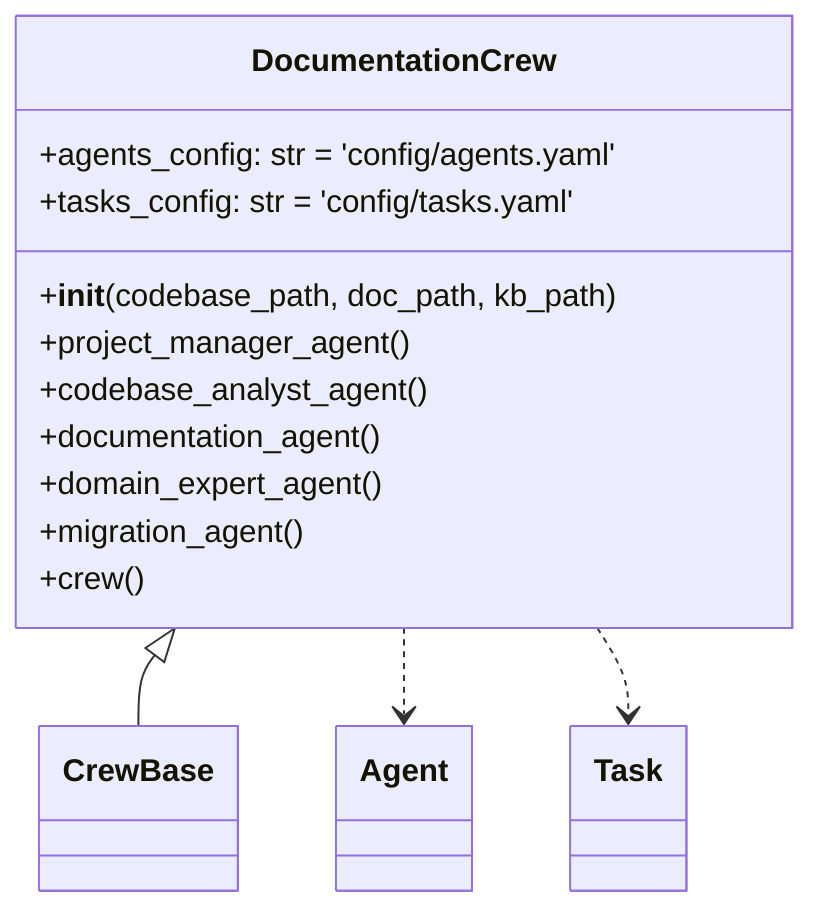
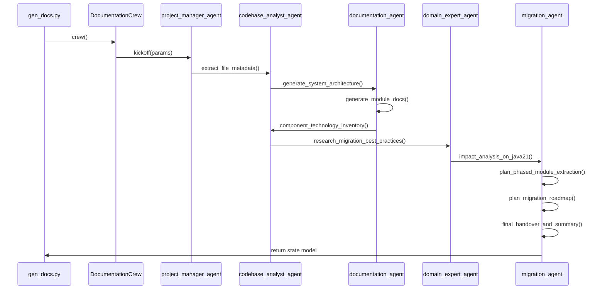

## Documentation Pipeline Analysis

This document provides an in-depth technical analysis of the **DocumentationPipeline**, comprising the `gen_docs.py` entry-point orchestrating the `DocumentationCrew` defined in `documentation_crew.py`, with configurations sourced from `agents.yaml` and `tasks.yaml`.

---

### 1. `gen_docs.py`: Pipeline Entry Point

The `gen_docs.py` script (alias `src/main.py`) bootstraps the pipeline via a simple CLI:

```bash
$ python3 gen_docs.py <path_to_codebase_or_git_url>
```

1. **prepare\_codebase**: Clones or copies the target repository, returning a local `codebase_path` and setting `CODE_PATH`.
2. **Environment Setup**:

   * Reads `LLM_PROVIDER` from the environment and logs the active GenAI provider.
   * Defines directories:

     * `1-documentation/docs`: Markdown outputs
     * `1-documentation/state`: JSON state snapshots
     * `kb-docs`: Knowledge-base artifacts
3. **Crew Instantiation**:

   ```python
   crew = DocumentationCrew(codebase_path, docs_dir, kb_dir).crew()
   ```
4. **Pipeline Kickoff**:

   ```python
   state = crew.kickoff({
     "codebase": os.path.basename(codebase_path),
     "code_path": codebase_path,
     "doc_path": os.path.abspath(docs_dir),
     "kb_path": os.path.basename(kb_dir)
   })
   ```
5. **State Persistence**: Serializes the returned state model to `1-documentation/state/documentation_state.json`.
6. **Completion**: Logs success and points to generated docs and state.

---

### 2. `DocumentationCrew`: Core Class Structure

The `DocumentationCrew` (in `crews.documentation.documentation_crew`) extends `CrewBase`, wiring together agents, tools, and tasks:



* **Constructor**:

  * Initializes `codebase_path`, `doc_path`, `kb_path`.
  * Sets up cached tools:

    * `DirectoryReadTool` & `FileReadTool` for both code and KB.

### 3 Agents, Tasks, and Crew
See [Documentation Crew document](https://github.com/gsantopaolo/reforge-ai/blob/main/docs/documentation_crew.md)


### 4. Task Workflow Diagram

```mermaid
flowchart LR
  EFMD[Extract File Metadata] --> GSA[Generate System Architecture]
  GSA --> GMD[Generate Module Docs]
  GMD --> CTI[Component & Tech Inventory]
  CTI --> RMB[Research Migration Best Practices]
  RMB --> IA[Java21 Impact Analysis]
  IA --> PME[Plan Phased Module Extraction]
  PME --> PMR[Plan Migration Roadmap]
  PMR --> FHS[Final Handover & Summary]
```



---

### 5. Execution Sequence



---

### 6. Outputs

* **Markdown Artifacts**: Individual task docs in `1-documentation/docs/`.
* **Pipeline State**: JSON at `1-documentation/state/documentation_state.json`.
* **Knowledge Base**: Intermediate logs & artifacts in `kb-docs/`.
