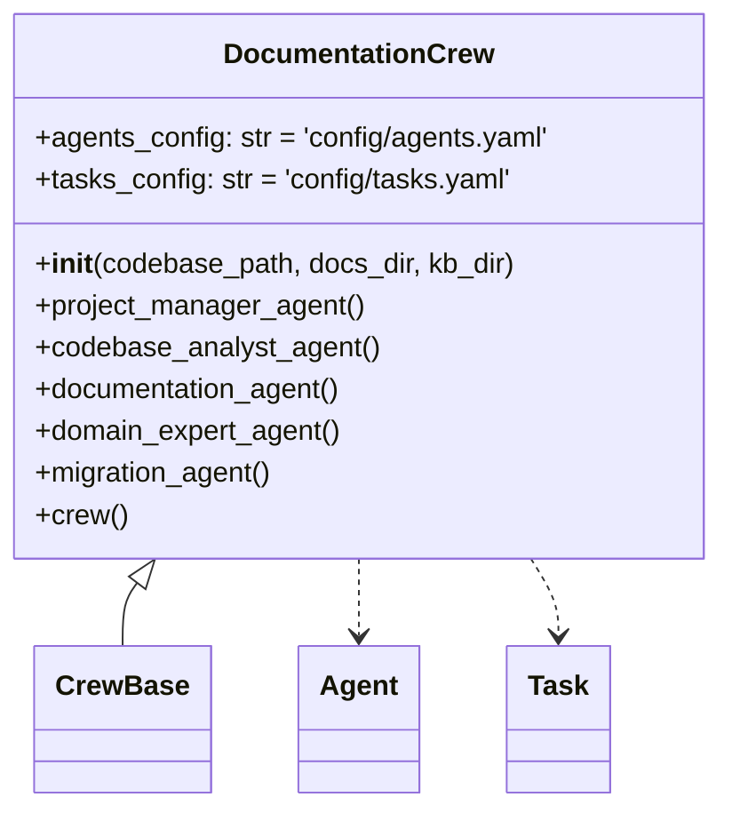
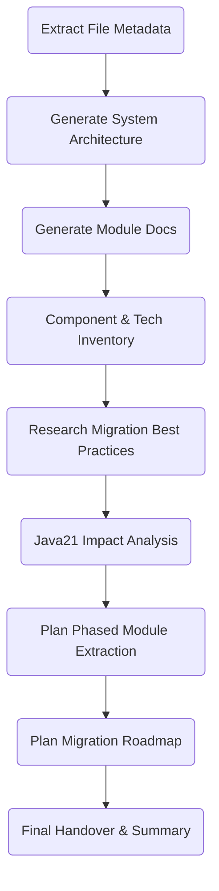
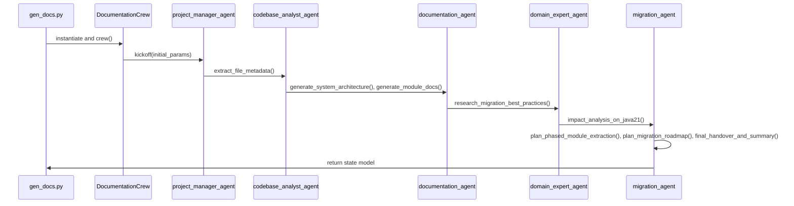

## Documentation Pipeline Analysis

This document provides a detailed technical analysis of the **DocumentationPipeline**, which is implemented by `gen_docs.py` orchestrating the `DocumentationCrew` defined in `documentation_crew.py`, using the configurations in `agents.yaml` and `tasks.yaml`.

---

### 1. gen\_docs.py: Pipeline Entry Point

`gen_docs.py` is the CLI bootstrap script for the documentation pipeline:

```bash
$ python3 gen_docs.py <path_to_codebase_or_git_url>
```

1. **prepare\_codebase**: Clones or copies the target code repository into a local folder and sets `CODE_PATH`.
2. **Directory Setup**:

   * Creates `1-documentation/docs` for generated Markdown files.
   * Creates `1-documentation/state` for storing pipeline state.
   * Uses `kb-docs` as the knowledge base directory for intermediate artifacts.
3. **Crew Instantiation**:

   ```python
   crew = DocumentationCrew(codebase_path, docs_dir, kb_dir).crew()
   ```
4. **Kickoff**:

   ```python
   state = crew.kickoff({
     "codebase": os.path.basename(codebase_path),
     "code_path": codebase_path,
     "doc_path": os.path.abspath(docs_dir),
     "kb_path": os.path.basename(kb_dir)
   })
   ```
5. **Persist State**: Writes pipeline state to `1-documentation/state/documentation_state.json`.

---

### 2. DocumentationCrew Class Structure

`documentation_crew.py` defines the `DocumentationCrew` class, which extends `CrewBase` and wires together agents and tasks:



* **Agents Config**: `config/agents.yaml` defines roles, goals, and backstories for each agent.
* **Tasks Config**: `config/tasks.yaml` lists tasks, descriptions, expected outputs, and agent assignments.
* **Agent Methods**: Decorated with `@agent`, these factory methods instantiate `Agent` objects, binding each agent to its portion of the workflow and injecting the specific tools they need.
* **Task Methods**: Decorated with `@task`, these methods wrap each entry in `tasks.yaml` into a `Task` with a designated output file.
* **Crew Graph**: The `@crew` method collects all agents (except the manager), applies a **hierarchical** execution process, and sets the `project_manager_agent` as the orchestrator.

---

### 3. Agents & Tools

Agents are bound to different phases of the pipeline and have distinct responsibilities:

| Agent                        | Role Summary                                            | Tools Injected                                                                            |
| ---------------------------- | ------------------------------------------------------- | ----------------------------------------------------------------------------------------- |
| **project\_manager\_agent**  | Strategic orchestrator; enforces standards and sprints. | (No direct tools, delegates to other agents.)                                             |
| **codebase\_analyst\_agent** | Static analysis; dependency mapping and indexing.       | `DependencyMapperTool`, `JDepsTool`, `SerperDevTool`, `DirectoryReadTool`, `FileReadTool` |
| **documentation\_agent**     | Converts code insights into docs and diagrams.          | `CodeParserTool`, `DirectoryReadTool`, `FileReadTool`                                     |
| **domain\_expert\_agent**    | Validates compliance against business rules.            | `SerperDevTool` (for web research)                                                        |
| **migration\_agent**         | Builds phased migration blueprints.                     | `SerperDevTool`, `DirectoryReadTool`, `FileReadTool`                                      |

---

### 4. Task Workflow

The pipeline consists of the following tasks, executed in a hierarchical sequence:



* **extract\_file\_metadata** (`codebase_analyst_agent`): Parses Java files, builds a file metadata index (`1-Metadata.md`).
* **generate\_system\_architecture** (`documentation_agent`): Produces high-level architecture diagrams (`2-SystemArchitecture.md`).
* **generate\_module\_docs** (`documentation_agent`): Auto-generates Javadoc enhancements, class & sequence diagrams (`3-ModuleDocumentation.md`).
* **component\_technology\_inventory** (`codebase_analyst_agent`): Enumerates libraries and frameworks, researches Java21 migration notes.
* **research\_migration\_best\_practices** (`domain_expert_agent`): Summarizes web-sourced migration patterns and case studies.
* **impact\_analysis\_on\_java21** (`migration_agent`): Maps legacy constructs to Java21/Spring Boot equivalents, assesses risks.
* **plan\_phased\_module\_extraction** (`migration_agent`, **human\_input**): Builds a detailed phased extraction plan with YAML outline.
* **plan\_migration\_roadmap** (`migration_agent`, **human\_input**): Aggregates all docs into a time-phased refactoring roadmap.
* **final\_handover\_and\_summary** (`migration_agent`): Produces executive report and optional slide deck.

---

### 5. Execution Sequence



---

### 6. Outputs

* **Documentation Files**: Under `1-documentation/docs`, one Markdown per task.
* **Pipeline State**: JSON snapshot in `1-documentation/state/documentation_state.json`.
* **Knowledge Base**: Raw artifacts under `kb-docs` for intermediate reference.


