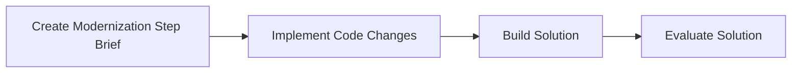

## Summary

The **Code Generation Crew** is an **agentic AI system** that autonomously:

1. **Prepares** a detailed modernization step brief based on the current phase of the extraction plan.
2. **Implements** code transformations to migrate legacy Java EE components to Java 21 and Spring Boot.
3. **Builds** the modernized multi‑module project and reports compilation status.
4. **Evaluates** the solution, collecting logs and prompting human approval or feedback.

This system leverages specialized agents and tools to ensure a robust, end‑to‑end modernization workflow.

---

## 1. Crew Definition

The crew follows a hierarchical process managed by a central team lead. It comprises four specialized agents:

| Agent ID                          | Role                                                     | Goal                                                                                                      |
| --------------------------------- | -------------------------------------------------------- | --------------------------------------------------------------------------------------------------------- |
| **team\_lead**                    | Team Lead - Code Modernization                           | Oversee each modernization step, coordinate agents, and manage human validation cycles.                   |
| **software\_architect**           | Software Architect - Modernization Strategist            | Produce the "Modernization Step Brief" by integrating plan details, generated docs, and code‑KB insights. |
| **principal\_software\_engineer** | Principal Software Engineer - Code Transformation Expert | Implement Java 21/Spring Boot code changes as defined in the brief and ensure a clean build.              |
| **build\_agent**                  | Build Automation Engineer                                | Compile the modernized codebase using Maven, reporting build status and logs.                             |

*Source: agents.yaml* citeturn1file0

---

## 2. Tools Catalog

These tools are configured in `gen_modern_crew.py` to support each agent’s tasks: citeturn2file4

| Tool Name                 | Source                              | Description                                                                           |
| ------------------------- | ----------------------------------- | ------------------------------------------------------------------------------------- |
| **DirectoryReadTool**     | `crewai_tools`                      | Recursively reads directory structures to locate code or KB artifacts.                |
| **FileReadTool**          | `crewai_tools`                      | Reads file contents (code or documentation) for downstream processing.                |
| **FileWriterTool**        | `crewai_tools`                      | Creates or updates files and directories in the working code tree.                    |
| **MavenBuildTool**        | `tools/maven_build_tool`            | Executes Maven builds, capturing console output for analysis.                         |
| **SerperDevTool**         | `crewai_tools`                      | Internet search utility for retrieving code migration best practices when needed.     |
| **FileManagementToolkit** | `langchain_community` + FS wrappers | Provides file operations (e.g., `copy_file`, `file_delete`) via `LangChainFSWrapper`. |

---

## 3. Task Breakdown

Tasks are defined in `tasks.yaml` and executed by the responsible agent in a **hierarchical** workflow: citeturn1file1

| Task ID                                | Description                                                                                                                                                                                                                         | Responsible Agent             | Human Input Required |
| -------------------------------------- | ----------------------------------------------------------------------------------------------------------------------------------------------------------------------------------------------------------------------------------- | ----------------------------- | -------------------- |
| **create\_modernization\_step\_brief** | Analyze `7-PlanPhasedModuleExtraction.yaml` to find the current phase, read all relevant docs (`docs/`, `kb-docs/`, `kb-code/`), and synthesize a detailed Modernization Step Brief listing objectives, analysis, and sources read. | software\_architect           | Yes                  |
| **implement\_code\_changes**           | Based on the brief, generate or modify Java 21/Spring Boot code, update POMs, and attempt compilation. Iterate with architect guidance and web searches up to 10 times if build errors occur.                                       | principal\_software\_engineer | No                   |
| **build\_solution**                    | Invoke the MavenBuildTool on the entire multi-module project and capture all build output, including success/failure status and full logs.                                                                                          | build\_agent                  | No                   |
| **evaluate\_solution**                 | Collect compilation status, logs, summary of changes, and file paths; present to human for review and prompt for “approve” or “reject.”                                                                                             | team\_lead                    | Yes                  |

---

## 4. Workflow Diagram

