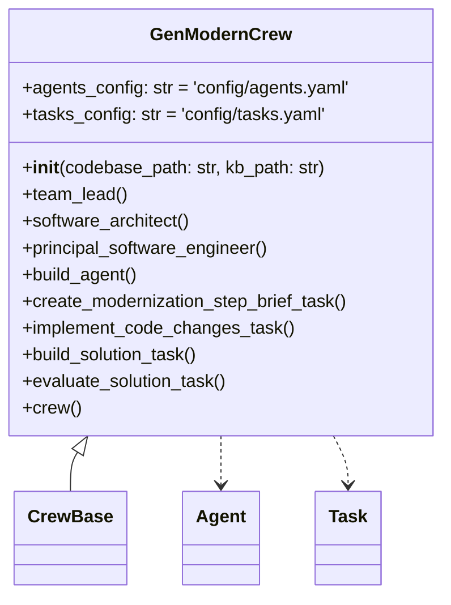
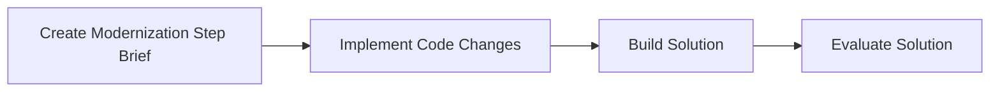
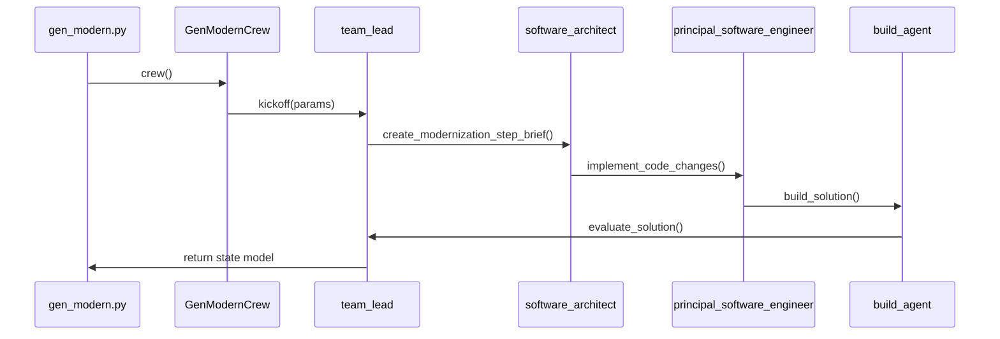

# Code Generation Technical Analysis

This document provides a comprehensive technical overview of the **GenModernCrew** pipeline, driven by the `gen_modern.py` entry point and the `GenModernCrew` class in `gen_modern_crew.py`, with agent and task behavior configured via `config/agents.yaml` and `config/tasks.yaml`.

---

## 1. `gen_modern.py`: Pipeline Entry Point

The `gen_modern.py` script initializes and runs the code modernization pipeline from the command line:

```bash
$ python3 gen_modern.py
```

1. **Environment & Paths**

   * Hardcoded or environment‐provided paths for the Java codebase (`codebase_path`) and knowledge base (`kb_path`) are validated.
   * Prints the codebase name and active GenAI provider (via `LLM_PROVIDER`) to the console.&#x20;

2. **Crew Kickoff**

   ```python
   crew = GenModernCrew(codebase_path, kb_path).crew()
   state = crew.kickoff({
     "code_path": codebase_path,
     "kb_path": os.path.basename(kb_path)
   })
   ```

   The pipeline is kicked off with a context dict containing the code and KB locations.&#x20;

3. **State Persistence**

   * The resulting state model is serialized to `gen_modern_state.json` under the designated `state_path`.
   * A completion message confirms where the modernization changes and state file reside.&#x20;

---

## 2. `GenModernCrew`: Core Class Structure

The `GenModernCrew` class, decorated with `@CrewBase`, wires together agents, tools, and tasks for Java‐to‐Spring‐Boot modernization :



### Constructor

* **Paths & Caching**
  Binds `codebase_path` and `kb_path`; wraps directory readers with caching.&#x20;
* **Tools Initialization**

  * `DirectoryReadTool` & `FileReadTool` for both code and KB directories.
  * Builds a file‐management toolkit via `FileManagementToolkit`, exposing `copy_file` and `file_delete` wrapped as `LangChainFSWrapper` tools (`fs_tools`).&#x20;
* **LLM Client**
  Shared `llm_client` instance built from `LLM_PROVIDER` and `MODEL_NAME`.&#x20;

---

## 3. Agents & Tools
### 3 Agents, Tasks, and Crew
See [Code Generation Crew document](https://github.com/gsantopaolo/reforge-ai/blob/main/docs/gen_code_crew.md)

---

## 4. Tasks & Workflow

Tasks configured in `config/tasks.yaml` are wrapped by `@task` methods and executed hierarchically :



| Task                                   | Config Key                        | Agent                           | Context                                    |
| -------------------------------------- | --------------------------------- | ------------------------------- | ------------------------------------------ |
| **create\_modernization\_step\_brief** | `create_modernization_step_brief` | `software_architect()`          | —                                          |
| **implement\_code\_changes**           | `implement_code_changes`          | `principal_software_engineer()` | `[create_modernization_step_brief_task()]` |
| **build\_solution**                    | `build_solution`                  | `build_agent()`                 | `[implement_code_changes_task()]`          |
| **evaluate\_solution**                 | `evaluate_solution`               | `team_lead()`                   | `[build_solution_task()]`                  |

---

## 5. Execution Sequence



---

## 6. Outputs

* **Modernized Code**
  Applied in-place in the `codebase_path` directory.
* **Pipeline State**
  JSON snapshot at `<state_path>/gen_modern_state.json`&#x20;
* **Knowledge Base Artifacts**
  Intermediate YAML/JSON briefs under the `kb_path` directory.
