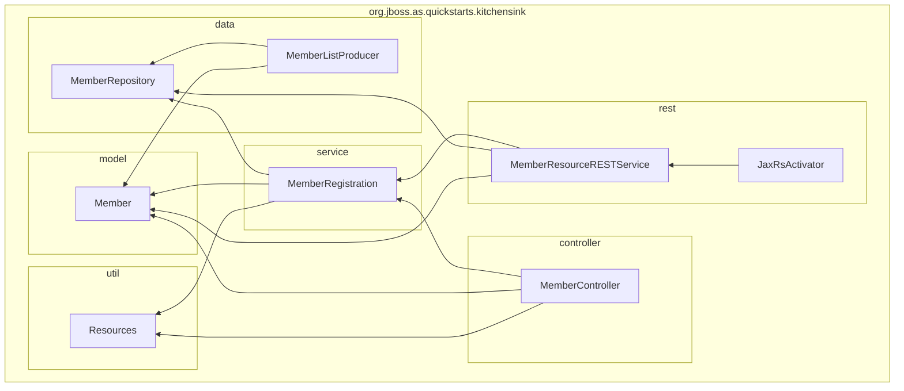
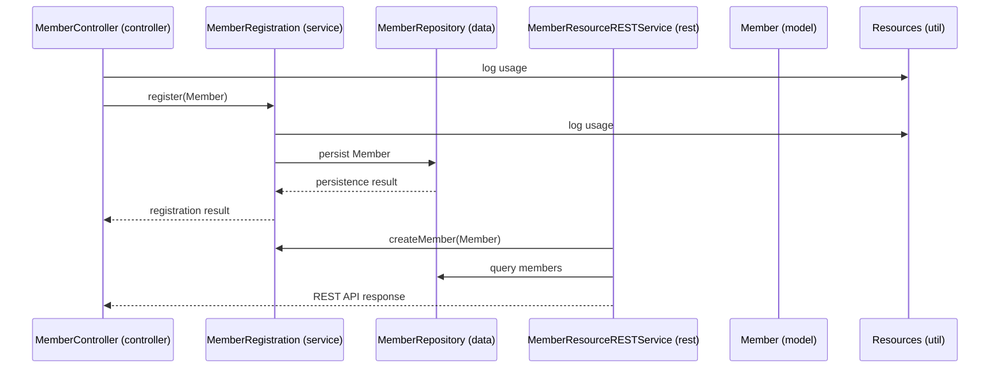

Component Interaction Sequence:

Narrative Description:
The system is structured into layered modules following a typical Java EE architecture. The core data model is the Member class representing user members with fields such as id, name, email, and phone number. The data package manages persistence with MemberRepository handling direct database access and MemberListProducer supporting member list management and events.

Business logic resides in the service package where MemberRegistration processes registration requests and interacts with the data layer. The controller package handles UI interactions, orchestrating member creation and validation via MemberController, which relies on the service layer and the model. 

A RESTful API is provided by the rest package, where MemberResourceRESTService exposes member-related endpoints for listing and creating members, mediated through the service and data layers. The JaxRsActivator configures REST activation.

Utility functionality like logging and resource handling is encapsulated in the util package, used cross-cuttingly by controller and service layers.

This modular architecture supports clear separation of concerns: model encapsulates data, data manages persistence, service contains business logic, controller manages UI flow, rest layer exposes APIs, and util provides generic support services. The component interactions enable member registration, querying, and RESTful access with logging integrated for auditing and debugging.

This structured design promotes maintainability, testability, and extensibility of the Java EE application.