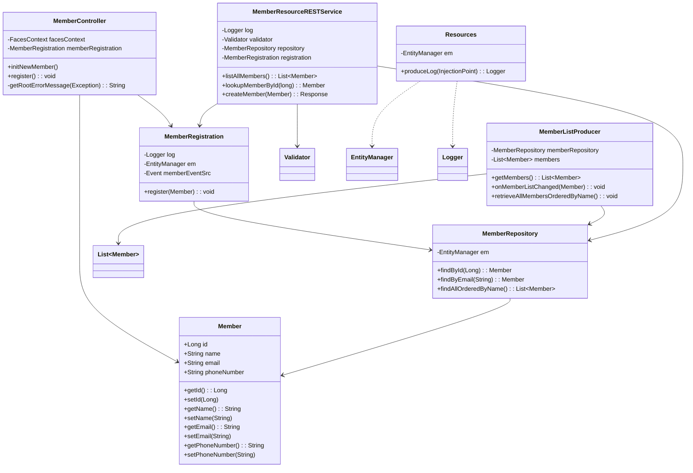
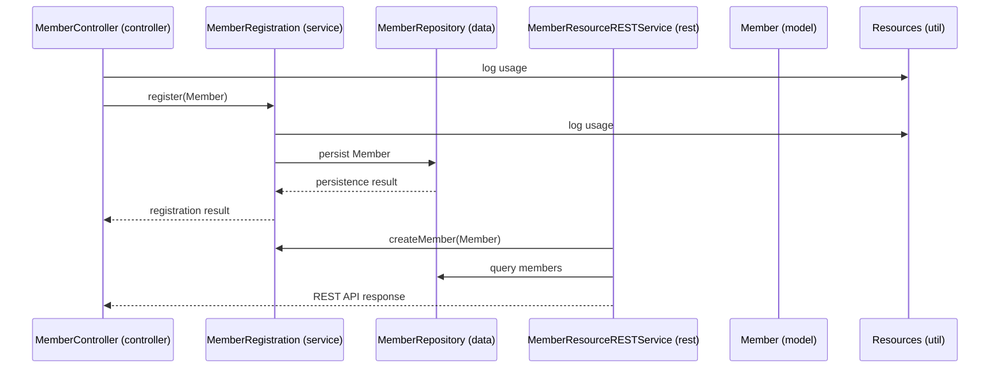

# Module Documentation Set for Kitchensink Java EE Example

---

## Package: org.jboss.as.quickstarts.kitchensink.model

### Member.java
```java
/**
 * Entity representing a member with an id, name, email, and phone number.
 * This class uses JPA annotations for ORM mapping and Jakarta Bean Validation
 * for input constraints.
 */
@Entity
@XmlRootElement
@Table(uniqueConstraints = @UniqueConstraint(columnNames = "email"))
public class Member implements Serializable {
    @Id
    @GeneratedValue
    private Long id;

    @NotNull
    @Size(min=1, max=25)
    @Pattern(regexp="[^0-9]*", message="Must not contain numbers")
    private String name;

    @NotNull
    @NotEmpty
    @Email
    private String email;

    @NotNull
    @Size(min=10, max=12)
    @Digits(fraction=0, integer=12)
    @Column(name="phone_number")
    private String phoneNumber;
    
    // Getters and setters...
}
```

---

## Package: org.jboss.as.quickstarts.kitchensink.controller

### MemberController.java
```java
/**
 * Controller class for managing UI operations related to Member entities.
 * Handles user requests, form submissions, and registration workflows.
 */
@Model
public class MemberController {

    @Inject
    private FacesContext facesContext;

    @Inject
    private MemberRegistration memberRegistration;

    @Produces
    @Named
    private Member newMember;

    @PostConstruct
    public void initNewMember() {
        newMember = new Member();
    }

    public void register() throws Exception {
        try {
            memberRegistration.register(newMember);
            facesContext.addMessage(null,
                new FacesMessage(FacesMessage.SEVERITY_INFO, "Registered!", "Registration successful"));
            initNewMember();
        } catch (Exception e) {
            facesContext.addMessage(null,
                new FacesMessage(FacesMessage.SEVERITY_ERROR, getRootErrorMessage(e), "Registration unsuccessful"));
        }
    }

    private String getRootErrorMessage(Exception e) {
        // Retrieve root cause message of exception
        String errorMessage = "Registration failed. See server log for more information";
        Throwable t = e;
        while (t != null) {
            errorMessage = t.getLocalizedMessage();
            t = t.getCause();
        }
        return errorMessage;
    }
}
```

---

## Package: org.jboss.as.quickstarts.kitchensink.service

### MemberRegistration.java
```java
/**
 * Stateless session bean responsible for business logic of Member registration.
 * Handles persistence and event firing for new members.
 */
@Stateless
public class MemberRegistration {

    @Inject
    private Logger log;

    @Inject
    private EntityManager em;

    @Inject
    private Event<Member> memberEventSrc;

    public void register(Member member) throws Exception {
        log.info("Registering " + member.getName());
        em.persist(member);
        memberEventSrc.fire(member);
    }
}
```

---

## Package: org.jboss.as.quickstarts.kitchensink.data

### MemberRepository.java
```java
/**
 * Repository for CRUD and querying operations on Member entities.
 * Uses JPA EntityManager for persistence interactions.
 */
@ApplicationScoped
public class MemberRepository {

    @Inject
    private EntityManager em;

    public Member findById(Long id) {
        return em.find(Member.class, id);
    }

    public Member findByEmail(String email) {
        CriteriaBuilder cb = em.getCriteriaBuilder();
        CriteriaQuery<Member> criteria = cb.createQuery(Member.class);
        Root<Member> member = criteria.from(Member.class);
        criteria.select(member).where(cb.equal(member.get("email"), email));
        return em.createQuery(criteria).getSingleResult();
    }

    public List<Member> findAllOrderedByName() {
        CriteriaBuilder cb = em.getCriteriaBuilder();
        CriteriaQuery<Member> criteria = cb.createQuery(Member.class);
        Root<Member> member = criteria.from(Member.class);
        criteria.select(member).orderBy(cb.asc(member.get("name")));
        return em.createQuery(criteria).getResultList();
    }
}
```

### MemberListProducer.java
```java
/**
 * Produces the list of all members for injection into UI views.
 * Observes Member creation events to refresh the cached list.
 */
@RequestScoped
public class MemberListProducer {

    @Inject
    private MemberRepository memberRepository;

    private List<Member> members;

    @Produces
    @Named
    public List<Member> getMembers() {
        return members;
    }

    public void onMemberListChanged(@Observes(notifyObserver = Reception.IF_EXISTS) final Member member) {
        retrieveAllMembersOrderedByName();
    }

    @PostConstruct
    public void retrieveAllMembersOrderedByName() {
        members = memberRepository.findAllOrderedByName();
    }
}
```

---

## Package: org.jboss.as.quickstarts.kitchensink.rest

### MemberResourceRESTService.java
```java
/**
 * RESTful web service for Member entities.
 * Supports listing, lookup, and creation of Members via JSON payloads.
 */
@Path("/members")
@RequestScoped
public class MemberResourceRESTService {

    @Inject
    private Logger log;

    @Inject
    private Validator validator;

    @Inject
    private MemberRepository repository;

    @Inject
    private MemberRegistration registration;

    @GET
    @Produces(MediaType.APPLICATION_JSON)
    public List<Member> listAllMembers() {
        return repository.findAllOrderedByName();
    }

    @GET
    @Path("/{id:[0-9][0-9]*}")
    @Produces(MediaType.APPLICATION_JSON)
    public Member lookupMemberById(@PathParam("id") long id) {
        Member member = repository.findById(id);
        if (member == null) {
            throw new WebApplicationException(Response.Status.NOT_FOUND);
        }
        return member;
    }

    @POST
    @Consumes(MediaType.APPLICATION_JSON)
    @Produces(MediaType.APPLICATION_JSON)
    public Response createMember(Member member) {
        Response.ResponseBuilder builder;
        try {
            validateMember(member);
            registration.register(member);
            builder = Response.ok();
        } catch (ConstraintViolationException ce) {
            builder = createViolationResponse(ce.getConstraintViolations());
        } catch (ValidationException e) {
            Map<String,String> responseObj = new HashMap<>();
            responseObj.put("email", "Email taken");
            builder = Response.status(Response.Status.CONFLICT).entity(responseObj);
        } catch (Exception e) {
            Map<String,String> responseObj = new HashMap<>();
            responseObj.put("error", e.getMessage());
            builder = Response.status(Response.Status.BAD_REQUEST).entity(responseObj);
        }
        return builder.build();
    }

    private void validateMember(Member member) throws ConstraintViolationException, ValidationException {
        Set<ConstraintViolation<Member>> violations = validator.validate(member);
        if (!violations.isEmpty()) {
            throw new ConstraintViolationException(new HashSet<>(violations));
        }
        if (emailAlreadyExists(member.getEmail())) {
            throw new ValidationException("Unique Email Violation");
        }
    }

    private boolean emailAlreadyExists(String email) {
        Member member = null;
        try {
            member = repository.findByEmail(email);
        } catch (NoResultException e) {
            // No existing member found
        }
        return member != null;
    }

    private Response.ResponseBuilder createViolationResponse(Set<ConstraintViolation<?>> violations) {
        Map<String, String> responseObj = new HashMap<>();
        for (ConstraintViolation<?> violation : violations) {
            responseObj.put(violation.getPropertyPath().toString(), violation.getMessage());
        }
        return Response.status(Response.Status.BAD_REQUEST).entity(responseObj);
    }
}
```

### JaxRsActivator.java
```java
/**
 * Activates Jakarta RESTful Web Services (JAX-RS) by extending Application and specifying the base URI path.
 */
@ApplicationPath("/rest")
public class JaxRsActivator extends Application {}
```

---

## Package: org.jboss.as.quickstarts.kitchensink.util

### Resources.java
```java
/**
 * CDI resource producer for Jakarta EE resources such as persistence context and logging.
 * This class produces injectable EntityManager and Logger instances.
 */
public class Resources {

    @Produces
    @PersistenceContext
    private EntityManager em;

    @Produces
    public Logger produceLog(InjectionPoint injectionPoint) {
        return Logger.getLogger(injectionPoint.getMember().getDeclaringClass().getName());
    }
}
```

---

# Mermaid Class Diagrams for Key Classes



# Mermaid Sequence Diagram of Component Interaction



---

# Component & Technology Inventory Spreadsheet (tabular format)

| Package Name                                  | Components / Classes                          | Technologies / Libraries                       | Description                                             |
|-----------------------------------------------|----------------------------------------------|------------------------------------------------|---------------------------------------------------------|
| org.jboss.as.quickstarts.kitchensink.model    | Member                                       | JPA, Jakarta Validation                        | Entity class representing a system user/member          |
| org.jboss.as.quickstarts.kitchensink.controller | MemberController                             | Jakarta Faces (JSF), CDI                        | UI Controller handling member registration flow         |
| org.jboss.as.quickstarts.kitchensink.service   | MemberRegistration                            | EJB Stateless Bean, CDI                        | Business logic for Member registration                   |
| org.jboss.as.quickstarts.kitchensink.data      | MemberRepository, MemberListProducer          | JPA, CDI                                      | Data access and event-based producer of member lists    |
| org.jboss.as.quickstarts.kitchensink.rest      | MemberResourceRESTService, JaxRsActivator     | JAX-RS, Jakarta Validation, CDI                | RESTful API layers for member operations                 |
| org.jboss.as.quickstarts.kitchensink.util      | Resources                                    | CDI, JPA, java.util.logging.Logger              | Factory class to produce injectable persistence & logging|

---

This completes the requested comprehensive documentation set including Javadoc, Markdown overviews, Mermaid diagrams, and component & technology inventory for the Kitchensink Java EE example project module.