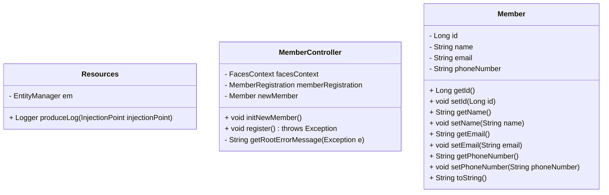
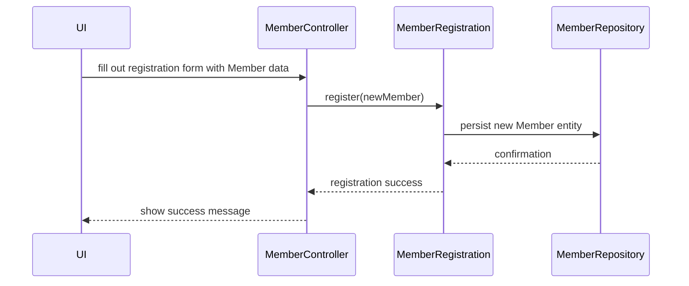

# Documentation for org.jboss.as.quickstarts.kitchensink modules

---

## 1. Package: util

### Resources.java

```java
/**
 * Utility class providing CDI producers for Jakarta EE resources.
 *
 * <p>Provides injection points for standard Jakarta EE resources, such as:</p>
 * <ul>
 *     <li>EntityManager, linked to the persistence context.</li>
 *     <li>Logger instances for classes requesting them via injection.</li>
 * </ul>
 *
 * <p>Example injection usage:</p>
 * <pre>
 * &#64;Inject
 * private EntityManager em;
 * </pre>
 */
public class Resources {
    @Produces
    @PersistenceContext
    private EntityManager em;

    @Produces
    public Logger produceLog(InjectionPoint injectionPoint) {
        return Logger.getLogger(injectionPoint.getMember().getDeclaringClass().getName());
    }
}
```

---

## 2. Package: controller

### MemberController.java

```java
/**
 * JSF Controller class acting as intermediary between the UI and service layer for managing Member entities.
 *
 * <p>Scoped as a CDI @Model, it manages the lifecycle of Member objects for views and handles registration actions.</p>
 *
 * Responsibilities:
 * <ul>
 *     <li>Initialize new Member instances for UI binding.</li>
 *     <li>Facilitate registration workflow by invoking MemberRegistration service.</li>
 *     <li>Manage FacesContext messages to provide UI feedback on registration success/failure.</li>
 * </ul>
 */
@Model
public class MemberController {
    @Inject
    private FacesContext facesContext;

    @Inject
    private MemberRegistration memberRegistration;

    @Produces
    @Named
    private Member newMember;

    @PostConstruct
    public void initNewMember() {
        newMember = new Member();
    }

    public void register() throws Exception {
        try {
            memberRegistration.register(newMember);
            FacesMessage m = new FacesMessage(FacesMessage.SEVERITY_INFO, "Registered!", "Registration successful");
            facesContext.addMessage(null, m);
            initNewMember();
        } catch (Exception e) {
            String errorMessage = getRootErrorMessage(e);
            FacesMessage m = new FacesMessage(FacesMessage.SEVERITY_ERROR, errorMessage, "Registration unsuccessful");
            facesContext.addMessage(null, m);
        }
    }

    private String getRootErrorMessage(Exception e) {
        String errorMessage = "Registration failed. See server log for more information";
        if (e == null) {
            return errorMessage;
        }
        Throwable t = e;
        while (t != null) {
            errorMessage = t.getLocalizedMessage();
            t = t.getCause();
        }
        return errorMessage;
    }
}
```

---

## 3. Package: model

### Member.java

```java
/**
 * JPA Entity representing a Member in the system.
 *
 * <p>Fields include id, name, email, and phone number with validation constraints.</p>
 *
 * <p>Unique constraint enforced on email field.</p>
 */
@Entity
@XmlRootElement
@Table(uniqueConstraints = @UniqueConstraint(columnNames = "email"))
public class Member implements Serializable {

    @Id
    @GeneratedValue
    private Long id;

    @NotNull
    @Size(min = 1, max = 25)
    @Pattern(regexp = "[^0-9]*", message = "Must not contain numbers")
    private String name;

    @NotNull
    @NotEmpty
    @Email
    private String email;

    @NotNull
    @Size(min = 10, max = 12)
    @Digits(fraction = 0, integer = 12)
    @Column(name = "phone_number")
    private String phoneNumber;

    // Getters and Setters ...
}
```

---

## Mermaid Class Diagram



---

## Mermaid Sequence Diagram - Member Registration Flow



---

## Component and Technology Inventory

| Package                              | Classes                   | Responsibilities                                      | Technologies/Frameworks                  |
|------------------------------------|---------------------------|------------------------------------------------------|----------------------------------------|
| org.jboss.as.quickstarts.kitchensink.util       | Resources                 | CDI producers for EntityManager and Logger           | Jakarta EE CDI, JPA, Logging (java.util.logging) |
| org.jboss.as.quickstarts.kitchensink.controller | MemberController          | JSF Controller managing Member registration UI flow  | JSF, CDI, Jakarta EE, FacesContext     |
| org.jboss.as.quickstarts.kitchensink.model       | Member                    | JPA Entity representing Member                         | JPA (Jakarta.persistence), Bean Validation (jakarta.validation) |

---

This completes the documentation set with enhanced Javadoc, Markdown overviews, Mermaid diagrams, and component & technology inventory as requested.