```mermaid
%% Package Hierarchy Diagram
graph TD
    A[kitchensink/src/main/java/org/jboss/as/quickstarts/kitchensink]

    A --> util_package[util]
    A --> controller_package[controller]
    A --> model_package[model]
    A --> service_package[service]
    A --> data_package[data]
    A --> rest_package[rest]

    util_package --> Resources
    controller_package --> MemberController
    model_package --> Member
    service_package --> MemberRegistration
    data_package --> MemberListProducer
    data_package --> MemberRepository
    rest_package --> JaxRsActivator
    rest_package --> MemberResourceRESTService

%% Component Interaction Diagram
%% Legend:
%% - Web/REST controllers handle client requests.
%% - Service layer contains business logic.
%% - Data layer handles persistence.
%% - Model layer contains domain entities.
%% - Util package contains utility classes.

classDef controller fill:#f9f,stroke:#333,stroke-width:1px;
classDef service fill:#bbf,stroke:#333,stroke-width:1px;
classDef data fill:#bfb,stroke:#333,stroke-width:1px;
classDef model fill:#fbf,stroke:#333,stroke-width:1px;
classDef rest fill:#fbb,stroke:#333,stroke-width:1px;
classDef util fill:#999,stroke:#333,stroke-width:1px;

subgraph REST Layer
    REST_Activator[JaxRsActivator]
    REST_MemberResource[MemberResourceRESTService]
end
class REST_Activator,REST_MemberResource rest;

subgraph Controller Layer
    Web_MemberController[MemberController]
end
class Web_MemberController controller;

subgraph Service Layer
    Service_MemberRegistration[MemberRegistration]
end
class Service_MemberRegistration service;

subgraph Data Layer
    Data_MemberRepository[MemberRepository]
    Data_MemberListProducer[MemberListProducer]
end
class Data_MemberRepository,Data_MemberListProducer data;

subgraph Model Layer
    Model_Member[Member]
end
class Model_Member model;

subgraph Util Layer
    Util_Resources[Resources]
end
class Util_Resources util;

%% Interaction flows
REST_Activator --> REST_MemberResource
REST_MemberResource --> Service_MemberRegistration
Web_MemberController --> Service_MemberRegistration
Service_MemberRegistration --> Data_MemberRepository
Service_MemberRegistration --> Data_MemberListProducer
Data_MemberRepository --> Model_Member
Data_MemberListProducer --> Model_Member
Service_MemberRegistration --> Model_Member
Web_MemberController --> Model_Member
REST_MemberResource --> Util_Resources
Web_MemberController --> Util_Resources
Service_MemberRegistration --> Util_Resources
Data_MemberRepository --> Util_Resources

```

# Narrative Explanation

The kitchensink example project is organized as a typical Java EE layered architecture consisting of six primary packages representing distinct functional layers:

1. **util**: Contains utility classes such as `Resources` that provide common resources or helper methods used across other layers.

2. **controller**: Contains web layer components like `MemberController` which handle HTTP requests in a traditional MVC style. This layer interacts with the service layer and prepares data for views.

3. **model**: Holds domain model classes such as `Member` representing business entities. These classes define the data structure and business objects used throughout the system.

4. **service**: Includes business logic classes like `MemberRegistration` responsible for application-specific operations such as registering members. This layer acts as a facade for business use cases.

5. **data**: Contains data access-related classes including `MemberRepository` and `MemberListProducer`. `MemberRepository` manages persistence and retrieval of `Member` entities, typically interacting with databases. `MemberListProducer` might provide lists or collections of members for injection or further business use.

6. **rest**: Comprises RESTful web service components such as `JaxRsActivator` (which activates REST endpoints) and `MemberResourceRESTService` that expose member-related RESTful APIs. These interact with the service layer to carry out business operations upon HTTP requests.

**Interactions:**

- The REST layer (`JaxRsActivator`, `MemberResourceRESTService`) exposes REST APIs to clients and delegates operations to the service layer.

- The web controller (`MemberController`) handles UI-driven HTTP requests (e.g., JSF or MVC views) and also calls service layer methods.

- The service layer (`MemberRegistration`) orchestrates business logic, receiving calls from both REST and web controller layers. It delegates data operations to the data layer and operates on model objects.

- The data layer (`MemberRepository`, `MemberListProducer`) manages data persistence and retrieval involving `Member` model entities. It abstracts underlying database or persistence API details.

- The model layer (`Member`) provides the domain entities used as data transfer objects throughout the system.

- The util package (`Resources`) provides common helper functionalities that aid various layers including REST, controller, service, and data.

Together, these layers form a coherent Java EE application where requests flow from REST/web controllers through business services into the data layer, leveraging model objects and utilities, facilitating a clean separation of concerns and maintainability.

This design supports extensibility, testability, and clear responsibility delineation enabling the kitchensink example to showcase multiple Java EE patterns and technologies effectively.