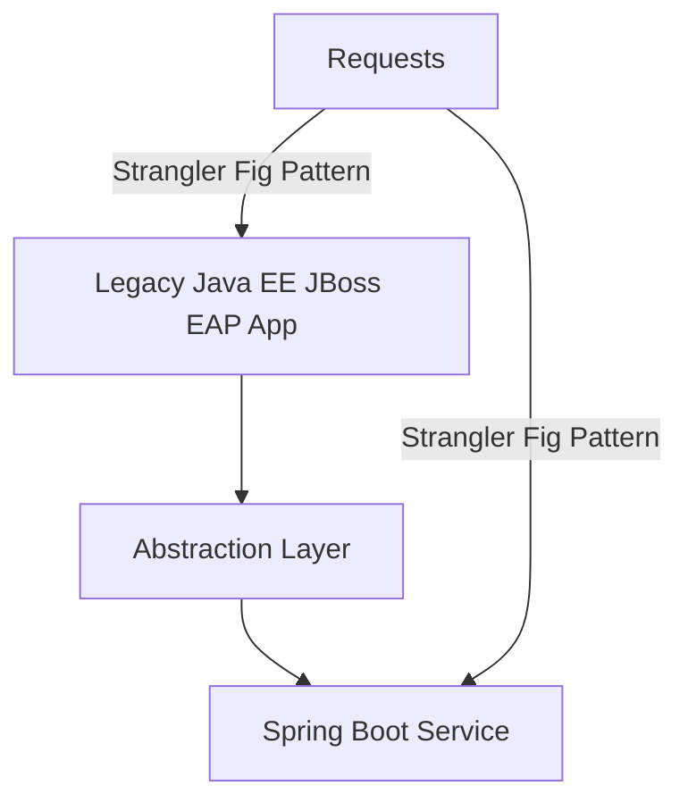

## Executive Summary

This report consolidates best practices, proven migration patterns, recommended tools, and case-study references to guide modernization efforts migrating Java EE applications running on Red Hat JBoss EAP to Spring Boot on Java 21, as well as replacing legacy frameworks with modern equivalents in logging, persistence, and more.

---

## Migration Patterns

### 1. Strangler Fig Pattern

- **Concept:** Incrementally replace legacy system parts with new Spring Boot based services, redirecting traffic gradually until the old system is fully replaced.
- **Use Case:** Allows risk-managed migration by maintaining functionality during transition.
- **Implementation:** Use API gateways or routing proxies to selectively send requests to old or new systems.

### 2. Branch-by-Abstraction

- **Concept:** Introduce an abstraction layer over legacy components to allow switching their implementations from Java EE/JBoss components to Spring Boot components without disrupting consumers.
- **Use Case:** Useful when a full rewrite is risky or infeasible upfront.
- **Implementation:** Refactor code to use interfaces, implement new code behind them, switch runtime bindings.

### 3. Incremental Decomposition and Modularization

- Modularize monolithic JBoss EE app into bounded contexts or microservices to migrate pieces independently.
- Gradually refactor business logic and database access layers (e.g., from EJBs and JPA to Spring Services and Spring Data).

---

## Recommended Tools

### 1. Red Hat Migration Toolkit for Runtimes (MTR)

- **Purpose:** Automates detection and analysis of Java EE APIs usage, suggests fixes and migration steps.
- **Features:** Provides detailed reports on dependencies, refactoring suggestions (e.g., javax.* to jakarta.* package changes).
- **Reference:** [Red Hat MTR docs](https://docs.redhat.com/en/documentation/migration_toolkit_for_runtimes/1.2/html-single/introduction_to_the_migration_toolkit_for_runtimes/index)

### 2. OpenRewrite

- **Purpose:** Automated source code refactoring tool supports complex transformations e.g., migrating Java EE code to modern Spring Boot idioms.
- **Supports:** Modernizing imports, annotations, package namespaces, and restructuring code.
- **Reference:** [OpenRewrite Spring Boot recipes](https://docs.openrewrite.org/recipes/java/spring/boot3/springboot3bestpractices)

### 3. JDeps (Java Dependency Analysis Tool)

- Useful for analyzing dependencies on JBoss EAP and Java EE modules to understand migration impact.
- Helps identify transitive dependencies on legacy libraries.

### 4. Flyway / Liquibase

- **Usage:** Database migration and version control tools recommended for managing schema evolution consistently during and after migration.
- **Benefit:** Enables smooth schema refactoring accompanying persistence layer modernization.

---

## Legacy Framework Modernization Recommendations

| Legacy Framework    | Modern Equivalent (Spring Boot / Java 21)             | Notes                                               |
|---------------------|-------------------------------------------------------|-----------------------------------------------------|
| JBoss Logging       | Spring Boot’s SLF4J with Logback                       | SLF4J abstraction with efficient logging backends   |
| Hibernate ORM       | Spring Data JPA with Hibernate                         | Spring Boot starter provides seamless integration   |
| JAX-RS (REST)       | Spring MVC / WebFlux REST controllers                  | Prefer @RestController and @RequestMapping           |
| EJB (Session Beans) | Spring services with @Service and @Transactional      | Use Spring’s declarative transactions                 |
| JSF (UI framework)  | Thymeleaf + Spring MVC views or SPA with React/Angular| Spring Boot does not natively support JSF             |
| JAXB (XML Binding)  | Jakarta XML Bind or alternatives                        | Use latest JAXB compatible with Java 21               |
| JSON Processing     | Jackson JSON (via Spring Boot starters)                | Built-in to Spring Boot REST communication            |

---

## Case-Study References

### Red Hat JBoss EAP to Spring Boot Migration

- Red Hat’s Migration Toolkit for Runtimes (MTR) used by numerous large enterprises to automate and accelerate migration from legacy JBoss EAP to Spring Boot.
- Detailed migration guides available on Red Hat’s documentation portals illustrate Java EE to Spring idiom replacements.
- [Red Hat Migration Guide](https://docs.redhat.com/en/documentation/red_hat_jboss_enterprise_application_platform/8.0/html-single/migration_guide/index)

### OpenRewrite Adoption

- Enterprise teams reporting significant reduction in manual migration errors and effort using OpenRewrite automated refactoring recipes tailored for Spring Boot.
- [OpenRewrite migration blog](https://www.moderne.ai/blog/speed-your-spring-boot-3-0-migration)

### Java 21 Adoption with Spring Boot 3.x

- Spring Boot 3.2 and Spring Framework 6.1 natively support Java 21 runtime, enabling better performance and future-proofing.
- Virtual threads, improved GC and performance tuning are supported in newer Java, beneficial for migrated apps.
- [InfoQ Spring Boot 3.2 + Java 21 article](https://www.infoq.com/articles/spring-boot-3-2-spring-6-1/)

---

## Summary

Successful Java EE to Spring Boot migration requires combining strategic patterns like Strangler Fig and Branch-by-Abstraction with a modern toolkit (MTR, OpenRewrite), while systematically replacing legacy frameworks and libraries with their modern Spring Boot equivalents. Using database migration tools ensures safe schema evolution. Real-world case studies from Red Hat customers and community projects demonstrate reliable paths to modernization on Java 21.

---

# Supplemental: Migration Patterns Mermaid Diagram

---

This completes the comprehensive Migration Practices Report covering patterns, tools, legacy framework upgrades, and case studies for migrating Java EE applications from Red Hat JBoss EAP to Spring Boot on Java 21.

If you require, I can also prepare detailed weekly documentation tasks or audit reports on your migration progress.