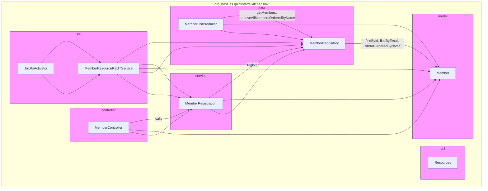

Narrative:

The kitchensink application is organized into multiple key package modules:

- **util**: Contains utility classes such as `Resources` for common reusable functions or logging.

- **model**: Defines core domain entities, notably the `Member` class representing a user/member.

- **data**: Responsible for data access, with `MemberRepository` providing CRUD and query operations on `Member` entities, and `MemberListProducer` acting as a producer/manager for member collections.

- **service**: Contains business logic components such as `MemberRegistration` which handles member registration processes, relying on `MemberRepository`.

- **controller**: The UI/web layer, with `MemberController` managing member-related UI flows and delegating to `MemberRegistration`.

- **rest**: Exposes RESTful API endpoints through `MemberResourceRESTService`, activated by `JaxRsActivator`. REST services interact with the service and data layers to fulfill client requests.

At runtime, user interactions flow from `MemberController` in the UI layer to the `MemberRegistration` service, which manipulates data via `MemberRepository`. Simultaneously, REST clients interact with `MemberResourceRESTService`, which coordinates with service and data layers similarly. The `MemberListProducer` assists in providing member lists to the UI. The modular package grouping provides separation of concerns between UI, business logic, data access, domain model, REST API exposure, and utilities.

This architecture enables clear layering, modularity, and single responsibility principles for maintainable extensible codebase structure.