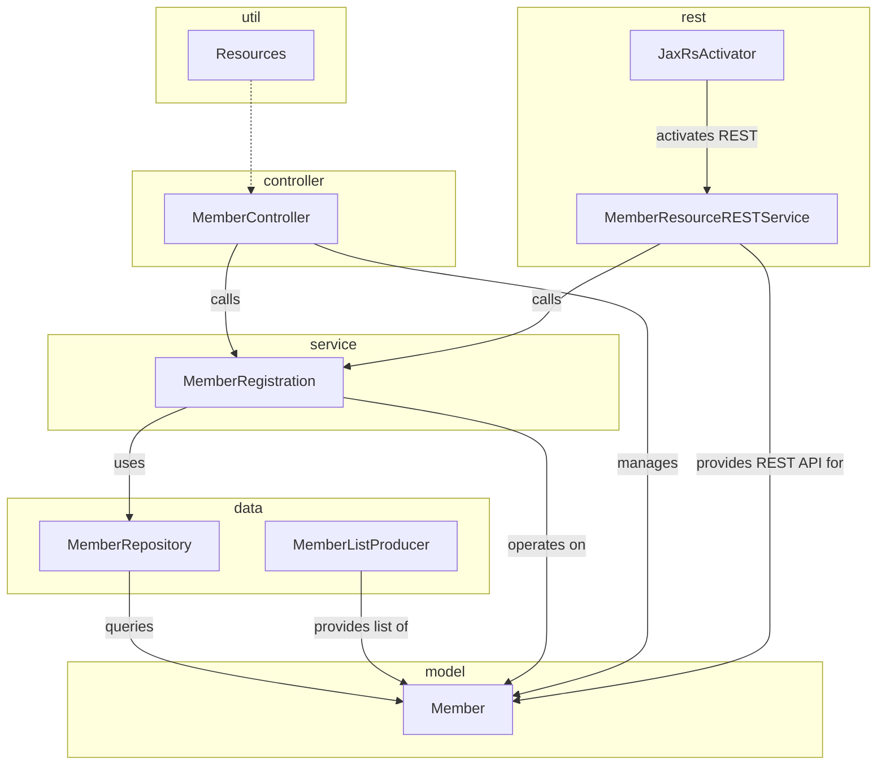

Narrative:

The kitchensink application follows a layered modular architecture dividing the codebase into distinct packages each responsible for well-defined roles.

The `model` package contains the core domain entities such as the `Member` class representing a user or member in the system.

The `data` package encapsulates persistence logic and data retrieval from storage. Classes like `MemberRepository` provide methods to query members by ID or email, while `MemberListProducer` manages producing collections of members, supporting the service layer.

Business logic resides in the `service` package, notably the `MemberRegistration` class, which orchestrates registering new members by utilizing the data repository and enforcing domain rules.

The `controller` package includes UI-facing classes like `MemberController` which manage user interactions and invoke the service layer to perform operations on members, handling errors and validation.

RESTful API exposure is handled by the `rest` package. The `JaxRsActivator` initializes REST resources, while `MemberResourceRESTService` implements REST endpoints, mapping HTTP requests to service methods for CRUD operations on members.

Finally, utility functionalities, such as logging provided by the `Resources` class in the `util` package, support other modules.

Interactions flow from REST and controller layers invoking service operations which themselves query and update data repositories, maintaining clean separation and modularity for ease of maintenance and expansion.